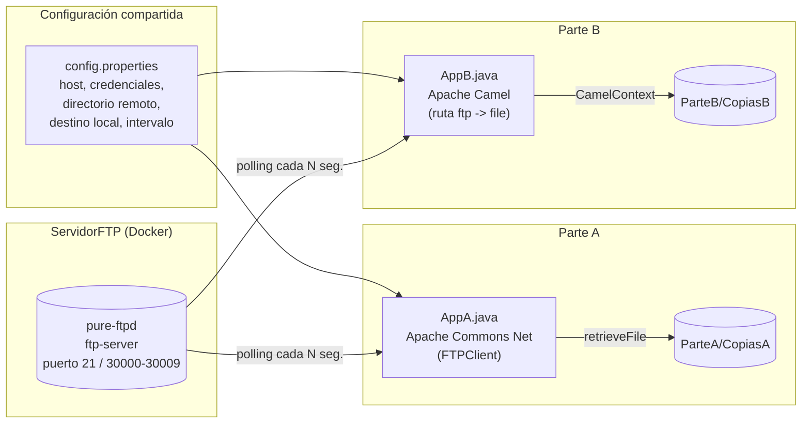

# Informe técnico — Monitoreo y réplica automática de un servidor FTP

## Tabla de contenidos

1. [Análisis del problema](#1-análisis-del-problema)
2. [Arquitectura de la solución](#2-arquitectura-de-la-solución)
3. [Decisiones arquitectónicas](#3-decisiones-arquitectónicas)
4. [Implementación del monitoreo — Parte A](#4-implementación-del-monitoreo--parte-a-apache-commons-net)
5. [Implementación del monitoreo — Parte B](#5-implementación-del-monitoreo--parte-b-apache-camel)
6. [Manejo de errores](#6-manejo-de-errores)
7. [Comparación Parte A vs. Parte B](#7-comparación-parte-a-vs-parte-b)
8. [Evidencias de funcionamiento](#8-evidencias-de-funcionamiento)
9. [Dificultades y soluciones](#9-dificultades-y-soluciones)
10. [Conclusiones](#10-conclusiones)

---

## 1. Análisis del problema

El ejercicio plantea un escenario típico de **integración de sistemas**: existe un servidor FTP donde distintos procesos depositan archivos, y se necesita **monitorear ese servidor de forma continua** para detectar archivos nuevos y **replicarlos automáticamente** en una carpeta local, sin intervención manual.

A partir de este enunciado se identificaron los siguientes requisitos:

- **Monitoreo continuo (polling):** el sistema debe revisar el servidor a intervalos regulares y configurables, no una sola vez.
- **Recorrido recursivo:** los archivos pueden estar organizados en subdirectorios dentro del FTP; el monitoreo debe alcanzarlos a todos.
- **No duplicar descargas:** un archivo ya descargado no debe volver a copiarse en el siguiente ciclo de polling.
- **Configuración externa:** host, credenciales, directorio remoto, destino local e intervalo de polling deben poder cambiarse sin recompilar el código.
- **Entorno reproducible:** se necesita un servidor FTP de pruebas que cualquier integrante del equipo pueda levantar igual, sin depender de un FTP externo.
- **Comparar dos enfoques de implementación:** uno de bajo nivel (control manual del protocolo) y uno de alto nivel (framework de integración), para evaluar trade-offs de arquitectura.

Estas dos últimas necesidades dieron origen a la separación del ejercicio en **Parte A** (implementación manual con Apache Commons Net) y **Parte B** (implementación declarativa con Apache Camel), ambas resolviendo el mismo problema desde paradigmas distintos.

## 2. Arquitectura de la solución



Ambas implementaciones comparten:

- El **mismo servidor FTP** contenerizado (`ServidorFTP/docker-compose.yml`).
- El **mismo archivo de configuración** (`taller/src/main/resources/config.properties`).
- El **mismo proyecto Maven**, pero en paquetes independientes (`com.arqui.ParteA` y `com.arqui.ParteB`), de modo que cada una se puede ejecutar de forma aislada.

## 3. Decisiones arquitectónicas

| Decisión | Justificación |
|---|---|
| Servidor FTP contenerizado con Docker Compose (`pure-ftpd`) | Entorno de pruebas reproducible e idéntico para todo el equipo, sin instalar ni configurar un FTP real en cada máquina. |
| Configuración externalizada en `config.properties` | Permite cambiar host, credenciales, directorio remoto, carpeta destino e intervalo de polling sin tocar ni recompilar el código, en línea con el principio de separar configuración del código. |
| Un solo proyecto Maven con dos paquetes (`ParteA`, `ParteB`) en vez de dos proyectos separados | Reutiliza dependencias y configuración comunes y facilita comparar ambas soluciones lado a lado con el mismo `pom.xml`. |
| Dos paradigmas de implementación distintos para el mismo problema | Permite comparar objetivamente un enfoque **imperativo/manual** (control total del protocolo FTP) contra un enfoque **declarativo basado en EIP** (Enterprise Integration Patterns) con un framework de integración, evaluando productividad, resiliencia y mantenibilidad. |
| Polling en vez de notificación por eventos | El protocolo FTP no soporta notificaciones push de archivos nuevos; el polling periódico es el mecanismo estándar para este tipo de integración. |
| Cada parte escribe en su propia subcarpeta (`ParteA/CopiasA`, `ParteB/CopiasB`) | Evita que ambas implementaciones se pisen entre sí al correr en paralelo sobre el mismo destino local, facilitando la comparación de resultados. |

## 4. Implementación del monitoreo — Parte A (Apache Commons Net)

**Archivo:** [`taller/src/main/java/com/arqui/ParteA/AppA.java`](taller/src/main/java/com/arqui/ParteA/AppA.java)

Funcionamiento:

1. Se carga `config.properties` desde el classpath.
2. Se abre **una sola conexión FTP** (`FTPClient`), en modo pasivo y binario, que se mantiene abierta durante toda la ejecución.
3. Un bucle infinito (`while (true)`) ejecuta `procesarDirectorio(...)` y luego espera `poll.interval.seconds` segundos con `Thread.sleep(...)`.
4. `procesarDirectorio` lista el contenido del directorio remoto con `ftp.listFiles(...)` y:
   - si la entrada es un directorio, se llama **recursivamente** sobre él (Commons Net no ofrece un listado recursivo nativo);
   - si es un archivo, se intenta descargar.
5. La **deduplicación** se controla manualmente con un `Set<String> archivosDescargados` en memoria, indexado por la ruta remota completa del archivo: si ya está en el set, se omite.
6. La descarga usa `ftp.retrieveFile(rutaRemota, out)` volcando el contenido a un `OutputStream` local, creando los directorios destino si no existen.

Esta implementación expone y resuelve **explícitamente** cada aspecto del problema (recursión, deduplicación, ciclo de polling), lo cual da control total pero traslada toda la responsabilidad al código propio.

## 5. Implementación del monitoreo — Parte B (Apache Camel)

**Archivo:** [`taller/src/main/java/com/arqui/ParteB/AppB.java`](taller/src/main/java/com/arqui/ParteB/AppB.java)

Funcionamiento:

1. Se carga la misma `config.properties`.
2. Se define una **ruta de Camel** (patrón EIP `from → to`) dentro de un `CamelContext`:
   ```
   from("ftp://host:puerto/directorio?...")
     .to("file:destino?autoCreate=true&fileName=${file:name}")
     .process(exchange -> imprimirArchivoDescargado(exchange));
   ```
3. Todo el comportamiento de polling, recursión y deduplicación se delega a **parámetros del endpoint FTP** de Camel, en vez de código propio:
   - `delay=<ms>` → intervalo de polling (equivalente al `Thread.sleep` de la Parte A).
   - `recursive=true` → recorrido recursivo de subdirectorios.
   - `idempotent=true` → Camel usa un repositorio idempotente en memoria para no reprocesar archivos ya descargados (equivalente al `Set` manual de la Parte A).
   - `noop=true` → el archivo **no se borra ni se mueve** en el FTP tras descargarlo (por defecto camel-ftp elimina/renombra el archivo origen al procesarlo).
   - `binary=true` y `passiveMode=true` → equivalentes a `setFileType(FTP.BINARY_FILE_TYPE)` y `enterLocalPassiveMode()` de la Parte A.
4. El proceso principal se mantiene vivo con `new CountDownLatch(1).await()`, ya que el propio `CamelContext` corre el polling en sus propios hilos internos.
5. Un `shutdown hook` invoca `contexto.stop()` para cerrar la ruta de forma ordenada al recibir `Ctrl+C` o una señal de terminación.

Esta implementación traduce el problema a un **flujo declarativo**: en lugar de programar cómo recorrer, deduplicar y descargar, se **configura** un endpoint que ya sabe hacerlo.

## 6. Manejo de errores

| Aspecto | Parte A (Commons Net) | Parte B (Camel) |
|---|---|---|
| Falta de `config.properties` | `RuntimeException` explícita al iniciar (falla rápido, `fail-fast`). | `RuntimeException` explícita al iniciar (mismo mecanismo, mismo criterio). |
| Error de red/IO durante un ciclo de polling | **No se captura**: la excepción se propaga fuera del `while(true)`, terminando el proceso completo. No hay reintentos ni reconexión automática. | El *consumer* de Camel captura los errores de cada poll internamente (`DefaultErrorHandler`); un fallo puntual se registra en el log pero **no detiene la ruta**, que reintenta en el siguiente ciclo. |
| Reconexión ante caída del servidor FTP | No implementada; requeriría envolver el ciclo en `try/catch` y volver a llamar a `conectarFTP`. | Manejada por el framework como parte del ciclo de vida del *consumer*. |
| Cierre ordenado del proceso | No aplica (no hay recursos que liberar de forma especial más allá de la conexión FTP). | `shutdown hook` + `contexto.stop()` para liberar hilos y conexiones de Camel de forma limpia. |
| Archivos con nombre/ruta inválida en Windows vs. Unix | No aplica directamente (uso de `Path`/`Paths` de Java). | Se normaliza manualmente el separador de rutas (`replace("\\","/")`) antes de construir el endpoint `file:`. |
| Caracteres especiales en usuario/contraseña | No aplica (se pasan como parámetros del método `login`, no como parte de una URI). | Se codifican con `URLEncoder.encode(...)`, porque usuario y contraseña forman parte de la URI del endpoint FTP y podrían romperla. |

**Conclusión de esta sección:** la Parte A tiene un manejo de errores **mínimo y deliberadamente simple** (fail-fast también ante errores de red, deteniendo todo el proceso), mientras que la Parte B hereda un manejo de errores **más robusto "gratis"** por apoyarse en un framework maduro, a cambio de menor visibilidad directa sobre qué ocurre internamente ante un fallo.

## 7. Comparación Parte A vs. Parte B

| Dimensión | Parte A — Apache Commons Net | Parte B — Apache Camel |
|---|---|---|
| Nivel de abstracción | Bajo (API imperativa sobre el protocolo FTP) | Alto (patrón EIP declarativo `from → to`) |
| Recorrido recursivo | Implementado a mano (`procesarDirectorio` recursivo) | Delegado al framework (`recursive=true`) |
| Deduplicación de archivos | `Set<String>` propio en memoria | Repositorio idempotente propio de Camel (`idempotent=true`) |
| Ciclo de polling | `while(true)` + `Thread.sleep` | Manejado por el *consumer* del endpoint (`delay=...`) |
| Resiliencia ante errores de red | Baja: un error detiene el proceso completo | Media/alta: un fallo puntual no detiene la ruta |
| Control fino del protocolo FTP | Alto (acceso directo a `FTPClient`) | Bajo (se interactúa vía parámetros de URI) |
| Extensibilidad (agregar pasos al flujo, ej. transformar o enviar a otro destino) | Requiere escribir más código imperativo | Trivial: agregar más `.to(...)` o componentes de Camel |
| Curva de aprendizaje | Baja si ya se conoce el protocolo FTP | Media: requiere entender la sintaxis de URIs y EIPs de Camel |
| Dependencias añadidas al proyecto | `commons-net` (liviana) | `camel-core`, `camel-file`, `camel-ftp` (más pesado) |
| Ideal para... | Entender el protocolo a bajo nivel / lógica muy específica no cubierta por el framework | Integraciones productivas que necesiten robustez y sean fáciles de extender |

## 8. Evidencias de funcionamiento

> Esta sección debe completarse con capturas reales de la ejecución. A continuación se listan los puntos donde deben insertarse, siguiendo el flujo descrito en el [README](README.md).

1. `[Captura 1: docker compose up -d levantando el contenedor ftp-server (docker ps mostrando el contenedor corriendo)]`
2. `[Captura 2: archivo(s) de prueba copiados dentro de ServidorFTP/ftp-data]`
3. `[Captura 3: consola ejecutando la Parte A — mensaje "Monitoreando el FTP en ..." y líneas "Descargado: ..."]`
4. `[Captura 4: carpeta ParteA/CopiasA con el/los archivo(s) descargado(s)]`
5. `[Captura 5: consola ejecutando la Parte B — mensaje "Apache Camel monitoreando el FTP" y líneas "Descargado con Camel: ..."]`
6. `[Captura 6: carpeta ParteB/CopiasB con el/los archivo(s) descargado(s)]`
7. `[Captura 7 (opcional): prueba de que un archivo repetido en un segundo ciclo de polling NO se vuelve a descargar/loguear, para evidenciar la deduplicación en ambas partes]`

## 9. Dificultades y soluciones

| # | Dificultad encontrada | Solución aplicada |
|---|---|---|
| 1 | `FTPClient` de Commons Net no ofrece un listado recursivo de directorios de forma nativa. | Se implementó recursión manual (`procesarDirectorio` se llama a sí misma al encontrar un subdirectorio), filtrando las entradas especiales `.` y `..`. |
| 2 | Evitar volver a descargar un archivo ya procesado en cada ciclo de polling. | Parte A: `Set<String>` en memoria indexado por ruta remota. Parte B: activar `idempotent=true` en el endpoint FTP de Camel. |
| 3 | Por defecto, `camel-ftp` mueve o elimina el archivo remoto luego de "consumirlo", lo cual no era deseable para un escenario de monitoreo/réplica (el archivo debía permanecer en el FTP). | Se agregó `noop=true` al endpoint, indicando a Camel que no debe alterar el archivo origen tras descargarlo. |
| 4 | Al construir la URI del endpoint FTP de Camel, usuario y contraseña con caracteres especiales podían romper el parseo de la URI. | Se codificaron con `URLEncoder.encode(usuario/password, UTF_8)` antes de concatenarlos en la URI. |
| 5 | Al construir el endpoint `file:` de destino en Camel, las rutas generadas por `Path` en Windows usan `\` y rompían la sintaxis del URI de Camel. | Se normalizó la ruta reemplazando `\` por `/` antes de construir el endpoint. |
| 6 | Mantener el proceso vivo indefinidamente mientras el polling corre en segundo plano. | Parte A: bucle explícito `while(true)` en el hilo principal. Parte B: como el `CamelContext` corre en hilos propios, se bloqueó el hilo principal con `new CountDownLatch(1).await()`. |
| 7 | Cierre abrupto de la ruta de Camel al terminar el proceso (`Ctrl+C`), dejando hilos o conexiones sin liberar. | Se registró un `Runtime.getRuntime().addShutdownHook(...)` que llama a `contexto.stop()` para un apagado ordenado. |
| 8 | Necesidad de un servidor FTP de pruebas reproducible sin depender de infraestructura externa ni de instalaciones distintas en cada máquina del equipo. | Se contenerizó un servidor `pure-ftpd` con Docker Compose, con usuario, puerto y volumen de datos predefinidos en `ServidorFTP/docker-compose.yml`. |
| 9 | La Parte A no tiene manejo de reconexión: un corte de red durante un ciclo de polling termina todo el proceso. | Se documentó como limitación conocida (ver sección 6) en vez de introducir manejo de errores adicional, para mantener el contraste didáctico frente a la resiliencia que ofrece Camel en la Parte B "out of the box". |

## 10. Conclusiones

- Ambas implementaciones resuelven correctamente el mismo problema de monitoreo y réplica de archivos desde un servidor FTP, pero desde paradigmas opuestos: **imperativo** (Parte A) vs. **declarativo/EIP** (Parte B).
- **Apache Commons Net (Parte A)** ofrece control total y transparencia sobre cada paso del protocolo FTP, a costa de tener que implementar manualmente aspectos como la recursión, la deduplicación y la resiliencia ante errores.
- **Apache Camel (Parte B)** resuelve el mismo problema con menos código de aplicación, delegando en el framework la recursión, la deduplicación (idempotencia) y una mayor tolerancia a fallos, a cambio de una curva de aprendizaje adicional (sintaxis de URIs y EIPs) y una dependencia más pesada.
- Para un escenario **educativo**, orientado a comprender el protocolo FTP y el ciclo de polling desde cero, la Parte A aporta más valor de aprendizaje. Para un escenario **productivo**, donde se necesite robustez, extensibilidad y menor tiempo de desarrollo, la Parte B (Camel) es la opción más adecuada.
- La externalización de la configuración y la contenerización del servidor FTP con Docker fueron decisiones clave que permitieron comparar ambas soluciones bajo las mismas condiciones, de forma reproducible.
