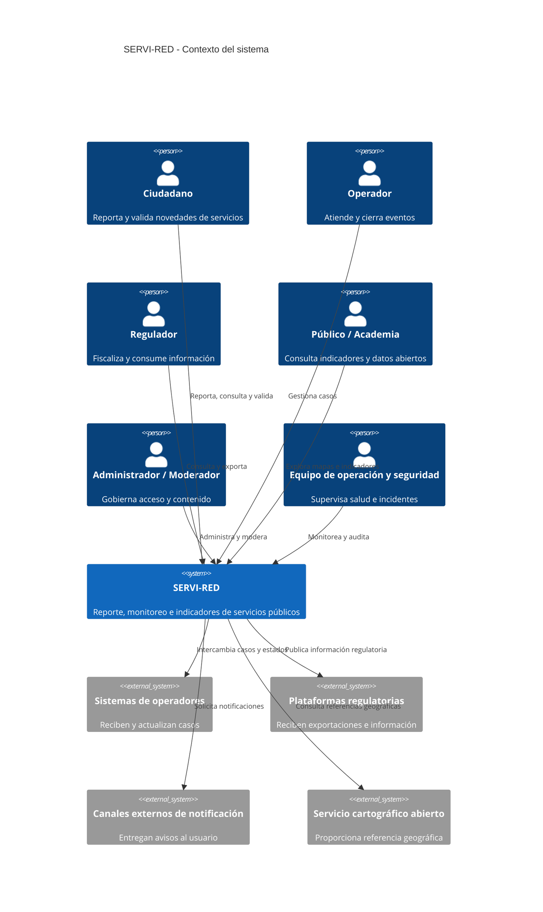
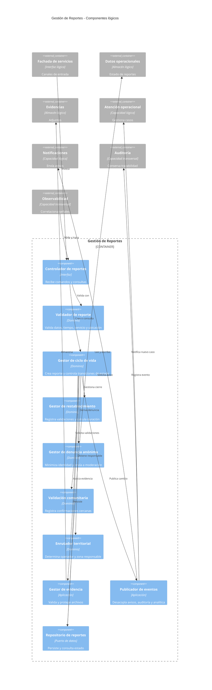
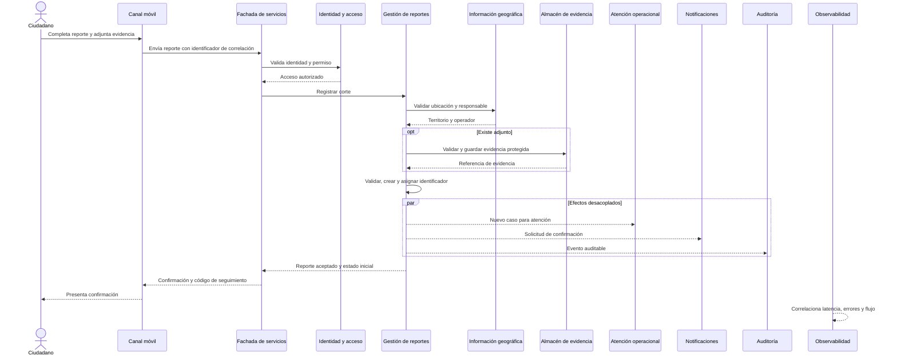
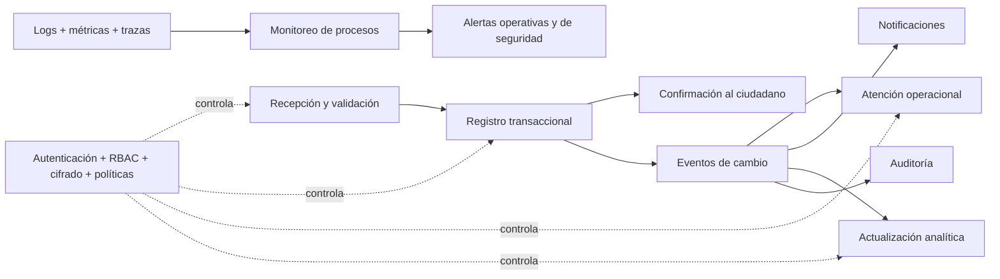
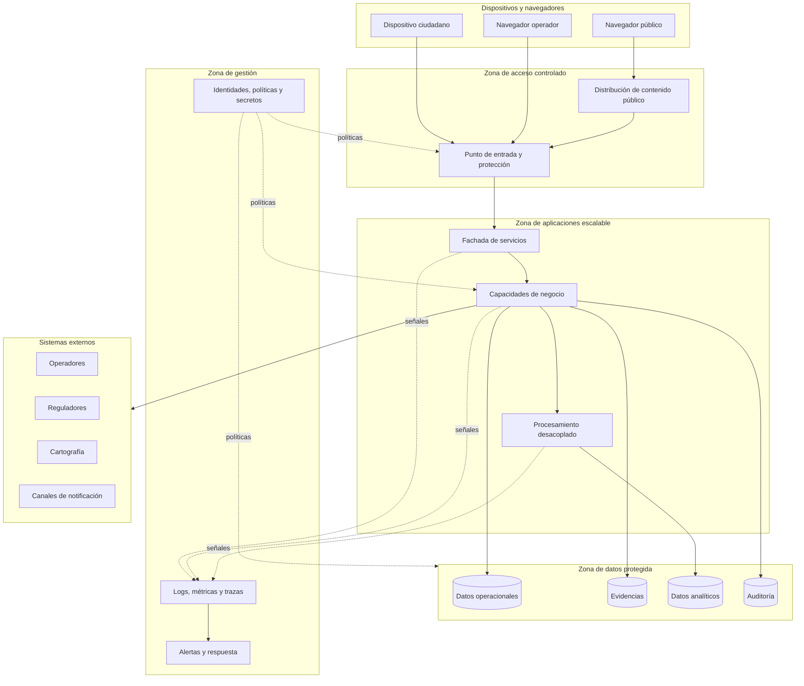

# SAD SERVI-RED - Entrega 1

## Arquitectura lógica sin tecnología

| Campo | Contenido |
|---|---|
| Sistema | SERVI-RED - Plataforma Colaborativa de Reporte y Monitoreo de Servicios Públicos Domiciliarios en Colombia |
| Documento | Software Architecture Document (SAD) |
| Entrega | No. 1 - Arquitectura lógica sin tecnología |
| Estado | Borrador para revisión del equipo y del profesor |
| Alcance tecnológico | Agnóstico de lenguajes, frameworks, motores de datos y proveedor de nube |

## 1. Propósito del documento

Este SAD define la arquitectura lógica inicial de SERVI-RED. Describe el alcance,
los actores, las capacidades, los atributos de calidad, las restricciones, las
decisiones arquitectónicas y las vistas necesarias para razonar sobre el sistema
antes de seleccionar tecnologías o iniciar su implementación.

El documento utiliza el modelo C4 para las vistas de contexto, contenedores y
componentes, complementado con vistas de procesos, desarrollo y despliegue. La
seguridad y la observabilidad se modelan como capas transversales que afectan a
todos los módulos y flujos.

## 2. Introducción y objetivos

### 2.1 Contexto del problema

En Colombia existen interrupciones no programadas y deficiencias de calidad en
servicios de energía, gas, acueducto, alcantarillado y recolección de residuos.
La información disponible suele estar dispersa, llegar tarde a operadores y
reguladores o no representar adecuadamente a comunidades rurales, periurbanas y
vulnerables. Esta asimetría dificulta la atención, la fiscalización y la toma de
decisiones basada en evidencia.

SERVI-RED propone un canal colaborativo para registrar eventos georreferenciados,
hacer seguimiento a su atención, validar restablecimientos, denunciar conexiones
fraudulentas de forma segura y generar información agregada de interés público.

### 2.2 Objetivo general

Diseñar una plataforma colaborativa web y móvil que permita documentar y
monitorear la calidad y continuidad de los servicios públicos domiciliarios en
Colombia, transformando reportes ciudadanos en información oportuna para
ciudadanos, operadores, reguladores y comunidades.

### 2.3 Objetivos específicos

- Facilitar el reporte accesible de cortes, restablecimientos y posibles fraudes.
- Conservar evidencia, ubicación, estado y trazabilidad de cada reporte.
- Permitir validación comunitaria de eventos cercanos.
- Proporcionar a los operadores una vista operacional para clasificar, atender y
  cerrar casos.
- Producir mapas, indicadores de continuidad y comparaciones territoriales.
- Publicar datos agregados y no sensibles para investigación y control social.
- Interoperar con operadores y entidades reguladoras mediante contratos abiertos.
- Proteger la identidad, ubicación y evidencia de los participantes.
- Detectar fallos operativos mediante métricas, logs, trazas y alertas.
- Mantener auditoría verificable de accesos, decisiones y cambios de estado.

### 2.4 Metas de negocio

- Reducir el tiempo entre la ocurrencia de una afectación y su visibilidad para
  el operador responsable.
- Aumentar la cobertura territorial de información sobre continuidad del servicio.
- Entregar evidencia trazable para fiscalización y formulación de políticas.
- Promover la participación comunitaria sin exponer a denunciantes vulnerables.
- Ofrecer información pública reutilizable sin divulgar datos personales.

### 2.5 Alcance funcional

Incluido en el alcance lógico:

- Registro y consulta de reportes de interrupción.
- Registro y validación comunitaria del restablecimiento.
- Reporte anónimo de posibles conexiones fraudulentas.
- Adjuntos, descripción, ubicación, servicio afectado, severidad y tiempos.
- Clasificación, asignación, seguimiento y cierre por parte del operador.
- Notificaciones y confirmaciones de recepción o cambio de estado.
- Mapas operacionales y públicos.
- Indicadores de frecuencia y duración de interrupciones.
- Exportación de información regulatoria y datos abiertos agregados.
- Gestión de identidades, roles, permisos y sesiones.
- Auditoría, trazabilidad, métricas, logs, alertas y monitoreo de procesos.

Fuera del alcance de esta entrega:

- Selección de lenguajes, frameworks o productos concretos.
- Diseño detallado de interfaz de usuario.
- Modelos físicos de base de datos.
- Código ejecutable e infraestructura aprovisionada.
- Automatización predictiva basada en inteligencia artificial.
- Integraciones definitivas con cada operador o regulador.

## 3. Interesados y necesidades

| Interesado | Necesidad principal | Preocupaciones arquitectónicas |
|---|---|---|
| Ciudadano identificado | Reportar, consultar y recibir seguimiento | Usabilidad, accesibilidad, privacidad y conectividad limitada |
| Denunciante anónimo | Informar un posible fraude sin ser identificado | Anonimato, minimización de datos y protección contra correlación |
| Operador de servicio | Priorizar, atender y cerrar novedades | Información oportuna, filtros, evidencia y trazabilidad |
| Moderador | Revisar contenido sensible o malintencionado | Control de acceso, evidencia, reglas y auditoría |
| Administrador | Gestionar organizaciones, usuarios, roles y políticas | Segregación de funciones y auditoría privilegiada |
| SSPD y entidades reguladoras | Consultar y exportar información verificable | Calidad, integridad, cobertura y trazabilidad del dato |
| Público, academia y periodistas | Explorar indicadores y descargar datos abiertos | Disponibilidad, anonimización y claridad metodológica |
| Equipo de operación | Conocer salud, rendimiento y fallos del sistema | Logs, métricas, trazas, alertas y procedimientos de respuesta |
| Responsable de seguridad y privacidad | Reducir riesgo y demostrar cumplimiento | RBAC, cifrado, auditoría, retención y gestión de incidentes |

## 4. Requerimientos funcionales de alto nivel

| Id | Requerimiento |
|---|---|
| RF-01 | Registrar un evento de corte no programado con tipo de servicio, descripción, ubicación, tiempo estimado, magnitud y evidencia opcional. |
| RF-02 | Confirmar la recepción y permitir consultar el estado y la historia del reporte. |
| RF-03 | Registrar el restablecimiento y calcular la duración total de la interrupción. |
| RF-04 | Permitir que ciudadanos cercanos confirmen o controviertan un evento o restablecimiento. |
| RF-05 | Recibir denuncias anónimas de conexiones fraudulentas y someterlas a moderación. |
| RF-06 | Enrutar el caso hacia el operador responsable según servicio y ubicación. |
| RF-07 | Permitir al operador filtrar, priorizar, asignar, actualizar y cerrar reportes. |
| RF-08 | Mostrar mapas de eventos activos, resueltos y agregados territoriales. |
| RF-09 | Calcular indicadores de frecuencia, duración, severidad y distribución geográfica. |
| RF-10 | Exportar datos regulatorios y publicar conjuntos abiertos anonimizados. |
| RF-11 | Administrar identidades, organizaciones, roles y permisos. |
| RF-12 | Registrar auditoría de accesos, cambios de estado, moderación, exportaciones y acciones administrativas. |
| RF-13 | Monitorear procesos críticos y generar alertas operativas y de seguridad. |

## 5. Requerimientos no funcionales

Los umbrales siguientes constituyen objetivos iniciales de aceptación. Deben ser
validados con los interesados y ajustados con datos de carga reales.

### 5.1 Rendimiento

| Id | Escenario medible |
|---|---|
| RNF-REN-01 | El 95 % de las operaciones de consulta o creación debe responder en máximo 2 segundos, excluyendo la carga de archivos grandes y latencia de terceros. |
| RNF-REN-02 | El 95 % de las vistas cartográficas iniciales debe presentar información útil en máximo 3 segundos para el ámbito geográfico solicitado. |
| RNF-REN-03 | Un reporte aceptado debe ser visible para el operador correspondiente en máximo 10 segundos. |
| RNF-REN-04 | Los cálculos analíticos intensivos no deben bloquear el registro ni la atención operacional de reportes. |

### 5.2 Disponibilidad y continuidad

| Id | Escenario medible |
|---|---|
| RNF-DIS-01 | Los canales de reporte y consulta deben alcanzar una disponibilidad mensual objetivo de 99,9 %. |
| RNF-DIS-02 | La falla de indicadores, exportaciones o notificaciones no debe impedir registrar un reporte válido. |
| RNF-DIS-03 | Objetivo inicial de recuperación: RTO máximo de 60 minutos y RPO máximo de 15 minutos para información operacional. |
| RNF-DIS-04 | Los componentes críticos deben evitar puntos únicos de falla y permitir recuperación verificable. |

### 5.3 Escalabilidad

| Id | Escenario medible |
|---|---|
| RNF-ESC-01 | El procesamiento de reportes, consultas de mapas, notificaciones y analítica debe poder escalar de forma independiente. |
| RNF-ESC-02 | El sistema debe absorber incrementos temporales de al menos diez veces la carga promedio en una zona afectada sin pérdida de reportes aceptados. |
| RNF-ESC-03 | La partición lógica por territorio, operador o período no debe cambiar los contratos externos. |

### 5.4 Seguridad y privacidad

| Id | Escenario medible |
|---|---|
| RNF-SEG-01 | Todo acceso no público debe autenticarse y autorizarse antes de ejecutar una operación. |
| RNF-SEG-02 | El control de acceso debe aplicar RBAC, mínimo privilegio y segregación entre ciudadano, operador, moderador, regulador y administrador. |
| RNF-SEG-03 | Los datos sensibles deben mantenerse cifrados en tránsito y en almacenamiento. |
| RNF-SEG-04 | Un reporte anónimo no debe guardar identificadores directos del denunciante; cualquier dato técnico imprescindible debe minimizarse y someterse a retención limitada. |
| RNF-SEG-05 | Accesos a evidencia, exportaciones, cambios de permisos y decisiones de moderación deben quedar auditados. |
| RNF-SEG-06 | El sistema debe limitar abuso, automatización maliciosa y carga de archivos peligrosos sin bloquear injustificadamente a comunidades legítimas. |

### 5.5 Observabilidad y operabilidad

| Id | Escenario medible |
|---|---|
| RNF-OBS-01 | Cada transacción debe tener un identificador de correlación propagado por todos los procesos involucrados. |
| RNF-OBS-02 | Los componentes deben emitir logs estructurados, métricas de salud, latencia, errores, volumen y saturación, sin exponer secretos ni datos personales. |
| RNF-OBS-03 | Los flujos críticos deben producir trazas que permitan localizar el punto de fallo. |
| RNF-OBS-04 | Deben existir alertas por indisponibilidad, aumento de errores, acumulación de trabajo, degradación de latencia, fallos de integración y eventos sospechosos de seguridad. |
| RNF-OBS-05 | Una alerta crítica debe notificarse al equipo responsable en máximo 5 minutos y enlazar con un procedimiento de respuesta. |

### 5.6 Accesibilidad y usabilidad

| Id | Escenario medible |
|---|---|
| RNF-ACC-01 | Los canales web y móvil deben cumplir como mínimo WCAG 2.2 nivel AA en los flujos esenciales. |
| RNF-ACC-02 | El flujo básico de reporte debe ser comprensible para personas con baja alfabetización digital y ofrecer alternativas al texto cuando sean viables. |
| RNF-ACC-03 | La aplicación móvil debe tolerar conectividad intermitente y evitar perder un borrador antes de su confirmación. |

### 5.7 Calidad e interoperabilidad de datos

| Id | Escenario medible |
|---|---|
| RNF-DAT-01 | Todo reporte debe validar campos obligatorios, ubicación, tipo de servicio y consistencia temporal. |
| RNF-DAT-02 | Las publicaciones abiertas deben eliminar o agregar datos que permitan identificar personas o ubicaciones sensibles. |
| RNF-DAT-03 | Los contratos de integración deben estar versionados, documentados y mantener compatibilidad durante un período acordado. |
| RNF-DAT-04 | Los indicadores deben registrar definición, fuente, período, cobertura y fecha de actualización. |

### 5.8 Mantenibilidad y evolución

| Id | Escenario medible |
|---|---|
| RNF-MAN-01 | Las capacidades de identidad, reportes, atención, indicadores, notificación, auditoría y observabilidad deben mantener responsabilidades explícitas. |
| RNF-MAN-02 | Los cambios de una capacidad no deben exigir modificar consumidores que respeten el contrato publicado. |
| RNF-MAN-03 | Las decisiones significativas deben registrarse mediante ADR y revisarse cuando cambien sus supuestos. |

## 6. Restricciones y supuestos

### 6.1 Restricciones

- La Entrega 1 debe describir arquitectura lógica sin seleccionar tecnologías.
- La solución debe ofrecer canales móvil y web y operar como plataforma SaaS.
- El ámbito inicial es Colombia y su división territorial y regulatoria.
- Deben contemplarse energía, gas, acueducto, alcantarillado, aseo y residuos.
- La meta de disponibilidad declarada por el enunciado es 99,9 %.
- La cartografía debe evitar dependencia obligatoria de licencias propietarias.
- Los datos agregados se publicarán como datos abiertos; los datos personales y
  sensibles no pueden convertirse en datos abiertos.
- El proyecto es académico, con presupuesto, tiempo y personal limitados.
- La arquitectura debe permitir una implementación posterior con dos ecosistemas
  empresariales, sin acoplar este SAD a ellos.

### 6.2 Supuestos

- El usuario autoriza ubicación y adjuntos cuando estos sean necesarios.
- Los operadores y reguladores proveerán responsables, cobertura territorial y
  reglas de integración confiables.
- Un reporte ciudadano es evidencia inicial, no confirmación automática de una
  falla ni prueba concluyente de fraude.
- La moderación combina reglas y revisión humana para casos sensibles.
- Existe conectividad intermitente; no se asume conexión permanente.
- Las entidades acordarán una taxonomía común de servicios, estados y severidad.
- Los umbrales de rendimiento y recuperación serán refinados tras pruebas y
  acuerdos de nivel de servicio.

## 7. Decisiones de arquitectura - ADR

### ADR-001 - Separar la arquitectura por capacidades del negocio

- **Estado:** propuesta aceptada para el diseño lógico.
- **Decisión:** organizar el sistema alrededor de Identidad y Acceso, Reportes,
  Atención Operacional, Georreferenciación, Indicadores y Datos Abiertos,
  Notificaciones, Auditoría y Observabilidad.
- **Justificación:** reduce el acoplamiento y permite evolución, escalamiento y
  control de acceso diferenciados.
- **Consecuencias:** exige contratos claros, correlación entre procesos y manejo
  explícito de fallos parciales.

### ADR-002 - Usar contratos de servicio versionados

- **Estado:** propuesta aceptada.
- **Decisión:** toda interacción entre canales, capacidades internas y sistemas
  externos debe realizarse mediante contratos documentados y versionados.
- **Justificación:** facilita interoperabilidad y evita dependencia de estructuras
  internas.
- **Consecuencias:** requiere gobierno de contratos, compatibilidad y pruebas de
  integración.

### ADR-003 - Procesar de forma asíncrona las actividades no críticas

- **Estado:** propuesta aceptada.
- **Decisión:** el registro y confirmación básica del reporte será el camino
  crítico; notificaciones, actualización analítica y exportaciones podrán
  procesarse de forma desacoplada.
- **Justificación:** una falla secundaria no debe impedir reportar una afectación.
- **Consecuencias:** introduce consistencia eventual, reintentos, deduplicación y
  monitoreo de trabajo pendiente.

### ADR-004 - Aplicar privacidad y seguridad desde el diseño

- **Estado:** propuesta aceptada.
- **Decisión:** minimizar datos personales, separar identidad de contenido,
  proteger denuncias anónimas, aplicar RBAC y cifrar datos sensibles.
- **Justificación:** la plataforma trata ubicaciones, evidencia y denuncias que
  podrían causar riesgos a ciudadanos.
- **Consecuencias:** limita algunos análisis, exige clasificación de información
  y controles específicos de acceso y retención.

### ADR-005 - Mantener auditoría independiente del log operacional

- **Estado:** propuesta aceptada.
- **Decisión:** registrar en una bitácora protegida las acciones relevantes de
  negocio y seguridad; los logs técnicos no reemplazan la auditoría.
- **Justificación:** la auditoría requiere integridad, retención y acceso distintos
  a los datos usados para diagnóstico.
- **Consecuencias:** aumenta almacenamiento y gobierno, pero permite rendición de
  cuentas e investigación de incidentes.

### ADR-006 - Tratar observabilidad como capacidad transversal

- **Estado:** propuesta aceptada.
- **Decisión:** todos los componentes deben emitir señales correlacionadas de
  logs, métricas y trazas y declarar sus condiciones de salud.
- **Justificación:** una plataforma distribuida no puede operarse únicamente con
  mensajes de error aislados.
- **Consecuencias:** exige estándares de instrumentación, tableros, alertas y
  responsables de respuesta desde el inicio.

### ADR-007 - Separar datos operacionales, evidencia y datos analíticos

- **Estado:** propuesta aceptada.
- **Decisión:** distinguir lógicamente el estado transaccional de reportes, los
  archivos de evidencia y las estructuras optimizadas para indicadores.
- **Justificación:** tienen patrones de acceso, sensibilidad, volumen y retención
  diferentes.
- **Consecuencias:** requiere sincronización controlada, linaje de datos y reglas
  específicas de respaldo y eliminación.

## 8. Vistas del sistema

### 8.1 Vista de contexto - C4 Nivel 1



### 8.2 Vista de contenedores lógicos - C4 Nivel 2

En esta vista, “contenedor” significa una unidad ejecutable o almacén lógico. No
implica el uso de una tecnología de contenerización.

```mermaid
C4Container
    title SERVI-RED - Contenedores lógicos
    Person(ciudadano, "Ciudadano", "Usuario móvil")
    Person(operador, "Operador", "Usuario profesional")
    Person(publico, "Público / Regulador", "Consumidor de información")
    Person(ops, "Operación y Seguridad", "Supervisa la plataforma")

    System_Boundary(s, "SERVI-RED") {
        Container(appMovil, "Canal ciudadano móvil", "Aplicación cliente", "Reporta, consulta y valida eventos")
        Container(portalOp, "Portal operacional", "Aplicación web", "Atención, moderación y administración")
        Container(portalPublico, "Portal público", "Aplicación web", "Mapas, indicadores y datos abiertos")
        Container(api, "Fachada de servicios", "Interfaz lógica", "Expone contratos y aplica políticas de entrada")
        Container(identidad, "Identidad y acceso", "Capacidad lógica", "Autenticación, RBAC y sesiones")
        Container(reportes, "Gestión de reportes", "Capacidad lógica", "Ciclo de vida, validaciones y evidencias")
        Container(atencion, "Atención operacional", "Capacidad lógica", "Asignación, prioridad, moderación y cierre")
        Container(geo, "Información geográfica", "Capacidad lógica", "Búsquedas territoriales y agregación espacial")
        Container(indicadores, "Indicadores y datos abiertos", "Capacidad lógica", "Estadísticas, exportación y publicación")
        Container(notificaciones, "Notificaciones", "Capacidad lógica", "Confirmaciones y avisos desacoplados")
        Container(auditoria, "Auditoría y trazabilidad", "Capacidad transversal", "Registra acciones verificables")
        Container(observabilidad, "Monitoreo y observabilidad", "Capacidad transversal", "Métricas, logs, trazas y alertas")
        ContainerDb(datosOp, "Datos operacionales", "Almacén lógico", "Reportes, estados y asignaciones")
        ContainerDb(evidencias, "Evidencias", "Almacén lógico", "Fotografías y adjuntos protegidos")
        ContainerDb(datosAnaliticos, "Datos analíticos", "Almacén lógico", "Agregados, indicadores y datos abiertos")
        ContainerDb(bitacora, "Bitácora de auditoría", "Almacén protegido", "Eventos de negocio y seguridad")
    }

    Rel(ciudadano, appMovil, "Usa")
    Rel(operador, portalOp, "Usa")
    Rel(publico, portalPublico, "Usa")
    Rel(appMovil, api, "Consume contratos")
    Rel(portalOp, api, "Consume contratos")
    Rel(portalPublico, api, "Consulta información pública")
    Rel(api, identidad, "Autentica y autoriza")
    Rel(api, reportes, "Gestiona solicitudes")
    Rel(api, atencion, "Gestiona casos")
    Rel(api, geo, "Consulta ubicación")
    Rel(api, indicadores, "Consulta y exporta")
    Rel(reportes, datosOp, "Lee y escribe")
    Rel(reportes, evidencias, "Protege adjuntos")
    Rel(reportes, notificaciones, "Publica cambios")
    Rel(atencion, datosOp, "Actualiza casos")
    Rel(indicadores, datosAnaliticos, "Calcula y publica")
    Rel(reportes, auditoria, "Registra eventos")
    Rel(atencion, auditoria, "Registra decisiones")
    Rel(identidad, auditoria, "Registra accesos")
    Rel(auditoria, bitacora, "Almacena")
    Rel(ops, observabilidad, "Consulta y responde alertas")
    Rel(observabilidad, api, "Observa")
    Rel(observabilidad, reportes, "Observa")
    Rel(observabilidad, atencion, "Observa")
    Rel(observabilidad, indicadores, "Observa")
```



### 8.3 Vista de componentes de Gestión de Reportes - C4 Nivel 3



### 8.4 Vista dinámica - Reporte de corte no programado



Flujos alternos relevantes:

- Si falla Notificaciones, el reporte permanece aceptado y el aviso se reintenta.
- Si la ubicación no puede validarse, el reporte queda pendiente de corrección o
  clasificación manual, sin asignación automática.
- Si la evidencia es inválida o peligrosa, se rechaza el adjunto y se conserva el
  reporte cuando la política lo permita.
- Si el usuario no está autorizado, no se crea el reporte identificado; el flujo
  anónimo se procesa mediante una política independiente.

### 8.5 Vista de procesos



- **Procesamiento síncrono:** autenticación, autorización, validación mínima,
  persistencia y confirmación del reporte.
- **Procesamiento asíncrono:** notificaciones, indicadores, exportaciones,
  integración externa y tareas de enriquecimiento.
- **Supervisión:** cada proceso emite señales correlacionadas y estados de salud.
- **Seguridad:** cada transición valida identidad o condición de anonimato,
  permisos, clasificación del dato y obligación de auditoría.

### 8.6 Vista de desarrollo

La organización propuesta expresa dependencias lógicas, no repositorios ni
tecnologías definitivas.

```text
servired/
├── canales/
│   ├── ciudadano-movil/
│   ├── operador-web/
│   └── publico-web/
├── capacidades/
│   ├── identidad-acceso/
│   ├── reportes/
│   ├── atencion-operacional/
│   ├── informacion-geografica/
│   ├── indicadores-datos-abiertos/
│   └── notificaciones/
├── transversal/
│   ├── seguridad-privacidad/
│   ├── auditoria-trazabilidad/
│   └── observabilidad-operacion/
├── contratos/
│   ├── interfaces-publicas/
│   ├── eventos/
│   └── integraciones-externas/
└── documentacion/
    ├── sad/
    ├── adr/
    ├── modelo-dominio/
    └── operacion-riesgos/
```

Reglas de dependencia:

- Los canales dependen de contratos, no de almacenamiento.
- El dominio de una capacidad no depende de interfaces de usuario.
- Las integraciones externas se aíslan mediante adaptadores.
- Seguridad, auditoría y observabilidad ofrecen contratos transversales comunes.
- Ningún módulo puede consultar directamente el almacén privado de otro módulo.

### 8.7 Vista física / despliegue lógico

La vista muestra zonas de ejecución sin seleccionar nube, sistema operativo,
orquestador ni producto concreto.



Principios físicos:

- Separar acceso público, aplicación, datos y gestión.
- Escalar de manera independiente acceso, capacidades y trabajo asíncrono.
- No exponer directamente almacenes de datos a usuarios o sistemas externos.
- Aislar evidencias y auditoría por su mayor sensibilidad.
- Mantener observabilidad disponible aun cuando una capacidad de negocio falle.
- Aplicar cifrado, identidad de cargas y mínimo privilegio entre zonas.

## 9. Capa transversal de monitoreo y observabilidad

### 9.1 Monitoreo de procesos

Procesos críticos a supervisar:

- Recepción, validación y persistencia de reportes.
- Carga y análisis de evidencia.
- Enrutamiento hacia el operador correspondiente.
- Cambios de estado y cierre de casos.
- Validación comunitaria de restablecimientos.
- Notificaciones y reintentos.
- Generación de indicadores y exportaciones.
- Integraciones con operadores y reguladores.
- Autenticación, autorización y auditoría.

Cada proceso debe publicar estado, último avance, duración, resultado, número de
reintentos y causa de fallo, usando el mismo identificador de correlación del
reporte o transacción.

### 9.2 Logs

- Formato estructurado y consistente.
- Niveles y categorías normalizados.
- Identificadores de correlación, componente, operación y resultado.
- Exclusión o enmascaramiento de contraseñas, tokens, evidencia y datos personales.
- Retención diferenciada por utilidad operativa y obligación legal.
- Acceso restringido y auditable.

### 9.3 Métricas

- Disponibilidad y salud por capacidad.
- Volumen de reportes por territorio, servicio y estado, sin dimensiones de alta
  cardinalidad que identifiquen personas.
- Latencia y tasa de error por operación.
- Saturación, capacidad y trabajo pendiente.
- Entregas y fallos de notificación.
- Edad del caso más antiguo sin procesar.
- Integraciones externas exitosas, lentas o fallidas.
- Intentos de acceso denegados y patrones anómalos.

### 9.4 Alertas

| Severidad | Ejemplos | Respuesta esperada |
|---|---|---|
| Crítica | No se pueden registrar reportes, pérdida de datos, exposición confirmada | Atención inmediata y activación del plan de incidente |
| Alta | Error sostenido, acumulación de trabajo, integración esencial caída | Diagnóstico prioritario y mitigación |
| Media | Degradación de latencia, fallos parciales o crecimiento de capacidad | Investigación dentro de la jornada operativa |
| Baja | Tendencia preventiva o condición no urgente | Revisión planificada |

Toda alerta debe indicar impacto, servicio afectado, evidencia, responsable y
procedimiento de diagnóstico. Alertar solo por síntomas accionables evita fatiga.

## 10. Capa transversal de seguridad

### 10.1 Control de acceso - RBAC

| Rol | Permisos generales |
|---|---|
| Ciudadano | Crear y consultar sus reportes; confirmar eventos permitidos |
| Operador | Consultar y gestionar casos de su organización y territorio |
| Moderador | Revisar contenido y denuncias según asignación |
| Regulador | Consultar información regulatoria y exportaciones autorizadas |
| Administrador organizacional | Gestionar miembros y roles de su organización |
| Administrador de plataforma | Operar configuración global con privilegios restringidos y auditados |
| Auditor | Consultar bitácoras y evidencia autorizada sin modificar casos |
| Operación y seguridad | Consultar telemetría e investigar incidentes sin acceso indiscriminado a contenido |

El permiso efectivo debe considerar rol, organización, territorio, tipo de
servicio, sensibilidad del dato y relación con el caso.

### 10.2 Autenticación y autorización

- Autenticación reforzada para operadores, moderadores y administradores.
- Sesiones limitadas, revocables y protegidas contra reutilización.
- Autorización verificada en cada operación sensible, no solo en la interfaz.
- Separación entre identidad ciudadana y contenido de denuncias anónimas.
- Revisión periódica de permisos y retiro inmediato al cambiar funciones.
- Protección contra fuerza bruta, automatización abusiva y secuestro de sesión.

### 10.3 Cifrado y protección de datos

- Cifrado de comunicaciones y de datos sensibles almacenados.
- Gestión separada y rotación de claves y secretos.
- Clasificación de datos: público, interno, confidencial y altamente sensible.
- Acceso temporal y justificado a fotografías, ubicación precisa y denuncias.
- Anonimización o agregación antes de publicar datos abiertos.
- Respaldo cifrado y eliminación conforme a políticas de retención.

### 10.4 Auditoría y trazabilidad

La bitácora debe registrar como mínimo:

- Identidad o actor técnico, organización y rol.
- Acción, recurso, fecha, resultado y motivo cuando aplique.
- Cambios anteriores y posteriores en estados críticos.
- Accesos y descargas de evidencia.
- Exportaciones, cambios de permisos y acciones administrativas.
- Decisiones de moderación y tratamiento de denuncias.
- Identificador de correlación para relacionar auditoría con trazas operativas.

Los registros deben ser protegidos contra alteración, con acceso restringido,
retención definida y capacidad de búsqueda para investigaciones.

## 11. Riesgos arquitectónicos

| Riesgo | Impacto | Mitigación arquitectónica |
|---|---|---|
| Reportes falsos o coordinados | Distorsión de indicadores y daño reputacional | Validación comunitaria, moderación, reputación y detección de anomalías |
| Exposición de denunciantes | Riesgo personal y legal | Minimización, separación de identidad, cifrado y acceso restringido |
| Brecha digital o conectividad limitada | Exclusión de comunidades objetivo | Flujos simples, accesibilidad, borradores y tolerancia a desconexión |
| Sobrecarga durante una afectación masiva | Indisponibilidad cuando más se necesita | Escalamiento independiente, control de carga y procesamiento desacoplado |
| Dependencia de datos externos | Flujos incompletos o incorrectos | Adaptadores, timeouts, reintentos y operación degradada |
| Indicadores sesgados | Decisiones públicas incorrectas | Metadatos de cobertura, calidad y metodología visible |
| Acumulación de evidencia | Costos y superficie de exposición | Retención, clasificación y almacenamiento separado |
| Falta de operación efectiva | Incidentes prolongados | Observabilidad, alertas accionables y procedimientos de respuesta |

## 12. Trazabilidad de objetivos y arquitectura

| Objetivo | Capacidades | Atributos y decisiones relacionadas |
|---|---|---|
| Reporte ciudadano accesible | Canal móvil, Reportes, Georreferenciación | RNF-ACC, RNF-REN, ADR-001 |
| Atención en tiempo real | Atención, Notificaciones, Integraciones | RNF-DIS, RNF-OBS, ADR-003 |
| Indicadores y datos abiertos | Indicadores, Datos analíticos | RNF-DAT, ADR-007 |
| Reporte anónimo de fraude | Reportes, Moderación, Seguridad | RNF-SEG, ADR-004 |
| Rendición de cuentas | Auditoría, Exportaciones | RNF-SEG-05, ADR-005 |
| Operación confiable | Observabilidad, Alertas | RNF-OBS, ADR-006 |

## 13. Glosario

| Término | Definición |
|---|---|
| SAD | Documento de Arquitectura de Software. |
| Reporte | Registro ciudadano de interrupción, restablecimiento o posible fraude. |
| Caso | Representación operacional de un reporte que requiere seguimiento. |
| Evidencia | Fotografía, descripción u otro adjunto asociado a un reporte. |
| Operador | Organización que presta un servicio público domiciliario. |
| Restablecimiento | Recuperación del servicio después de una interrupción. |
| Dato abierto | Información publicada para reutilización después de aplicar controles de privacidad. |
| RBAC | Control de acceso basado en roles. |
| Auditoría | Registro protegido de acciones relevantes de negocio y seguridad. |
| Observabilidad | Capacidad de entender el estado interno mediante logs, métricas y trazas. |
| RTO | Tiempo objetivo máximo para recuperar el servicio. |
| RPO | Pérdida máxima de información admisible medida en tiempo. |

## 14. Asuntos abiertos para validación

- [ ] Confirmar integrantes, versión, fecha y responsables de aprobación del SAD.
- [ ] Validar los umbrales de rendimiento, RTO y RPO con el profesor y el equipo.
- [ ] Definir reglas de asignación territorial cuando existan varios operadores.
- [ ] Acordar política de retención para reportes, ubicación, evidencia y auditoría.
- [ ] Precisar el tratamiento legal de denuncias anónimas y datos personales.
- [ ] Definir taxonomía de severidad y estados del caso.
- [ ] Priorizar capacidades del MVP y diferenciar claramente fases posteriores.
- [ ] Confirmar sistemas externos y contratos disponibles de operadores, SSPD y CRA.
- [ ] Elaborar catálogo de amenazas y casos de abuso antes de seleccionar tecnología.
- [ ] Acordar quién recibe cada alerta y los tiempos de atención.

## 15. Criterio de cierre de la Entrega 1

La primera entrega puede considerarse completa cuando:

- El alcance, interesados, objetivos y requisitos de alto nivel están aprobados.
- Los atributos de calidad tienen escenarios y umbrales verificables.
- Las restricciones, supuestos, riesgos y decisiones están registrados.
- Las vistas de contexto, contenedores, componentes, procesos, desarrollo y
  despliegue lógico son coherentes entre sí.
- Seguridad y observabilidad aparecen en requisitos, decisiones, vistas y flujos.
- Existe trazabilidad entre objetivos, capacidades y atributos de calidad.
- Los asuntos abiertos tienen responsable y fecha de decisión.
- El documento fue revisado por el equipo y no fija tecnologías antes de la
  siguiente entrega.
