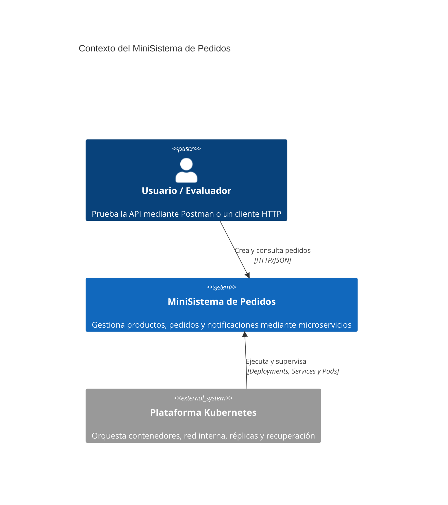
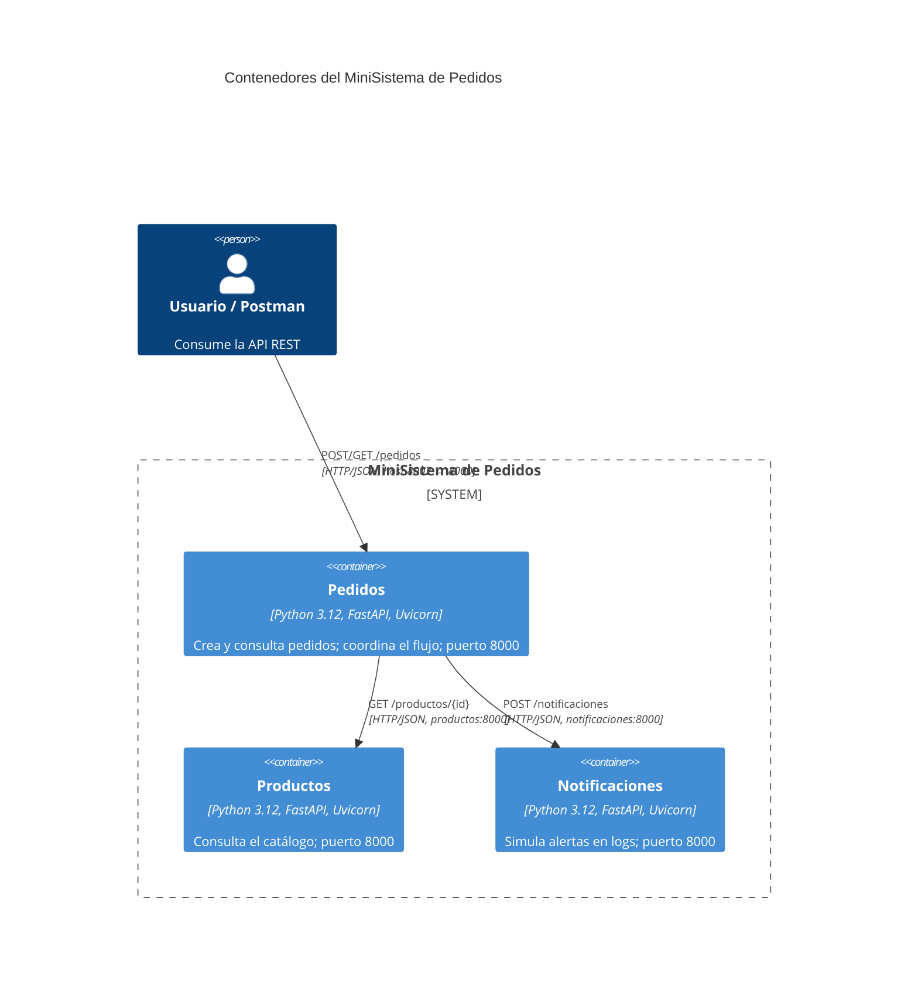
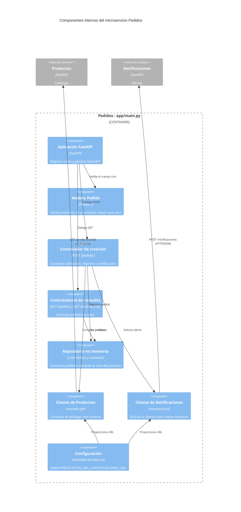
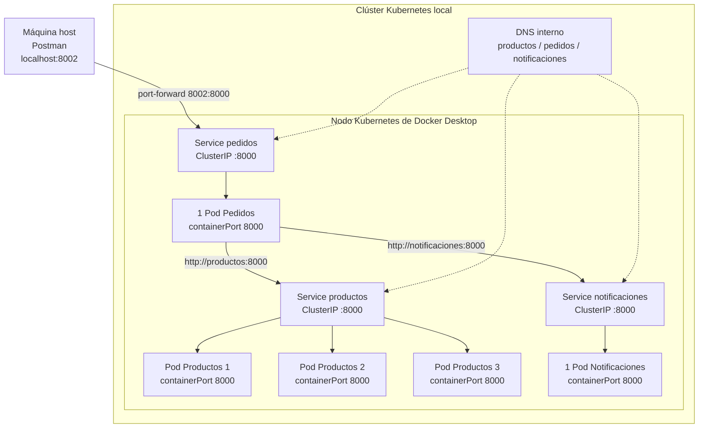

# Taller 3: Arquitectura de Microservicios con Docker y Kubernetes
**Integrantes:** Santiago Galindo, Roberth Méndez, Gabriel Jaramillo Cuberos, Jorge Enrique Olaya, Luz Adriana Salazar, Guden Sebastin Silva Rojas
**Universidad:** Pontificia Universidad Javeriana

---

## Contenido

1. [Introducción y descripción del problema](#1-introducción-y-descripción-del-problema)
2. [Vistas y diagramas de arquitectura](#2-vistas-y-diagramas-de-arquitectura)
3. [Implementación de los microservicios e integración](#3-implementación-de-los-microservicios-e-integración)
4. [Contenerización con Docker](#4-contenerización-con-docker)
5. [Despliegue, Service Discovery y escalabilidad en Kubernetes](#5-despliegue-service-discovery-y-escalabilidad-en-kubernetes)
6. [Estrategia y resultados de pruebas](#6-estrategia-y-resultados-de-pruebas)
7. [Análisis arquitectónico comparativo](#7-análisis-arquitectónico-comparativo)
8. [Repositorio, ejecución y anexos](#8-repositorio-ejecución-y-anexos)

---

# 1. Introducción y descripción del problema
El taller consiste en transformar conceptualmente un sistema monolítico de pedidos en una arquitectura basada en microservicios, utilizando **FastAPI, Docker y Kubernetes**. El sistema se divide en tres capacidades independientes: **Productos, Pedidos y Notificaciones**.

La solución permite consultar un catálogo de productos, crear pedidos asociados a productos existentes y simular el envío de notificaciones. Cada capacidad se implementa como un microservicio independiente, con su propia aplicación FastAPI, imagen Docker y ciclo de despliegue.

El propósito arquitectónico del ejercicio es observar las ventajas y costos de separar una aplicación en servicios independientes. En particular, se busca demostrar comunicación HTTP/REST entre servicios, descubrimiento mediante DNS de Kubernetes, escalamiento horizontal, balanceo de carga y recuperación automática ante fallos.

La arquitectura no utiliza una base de datos ni servicios externos reales. El almacenamiento de productos y pedidos se mantiene temporalmente en memoria, mientras que el envío de notificaciones se simula mediante registros en los logs del contenedor.

## 1.1 Objetivo general
Implementar y desplegar un MiniSistema de Pedidos basado en microservicios independientes, utilizando FastAPI para las APIs, Docker para la contenerización y Kubernetes para la orquestación, con el fin de analizar aspectos de integración, escalabilidad, disponibilidad y resiliencia de una arquitectura distribuida.

## 1.2 Objetivos específicos

- Implementar los microservicios de **Productos, Pedidos y Notificaciones** utilizando FastAPI.
- Exponer los recursos de cada microservicio mediante APIs REST.
- Contenerizar cada servicio mediante imágenes Docker independientes.
- Configurar la comunicación entre microservicios mediante HTTP/JSON.
- Utilizar Services y DNS interno de Kubernetes para evitar depender de las IP dinámicas de los Pods.
- Desplegar los microservicios mediante Deployments y Pods.
- Escalar horizontalmente el microservicio de Productos.
- Comprobar el balanceo de solicitudes entre réplicas.
- Simular la eliminación de un Pod y verificar la autorrecuperación proporcionada por Kubernetes.
- Validar el comportamiento del sistema ante la indisponibilidad del microservicio Productos.
- Comparar la arquitectura de microservicios con una alternativa monolítica.

## 1.3 Alcance
La solución cubre:

- Consulta del catálogo de productos.
- Consulta de un producto por identificador.
- Creación de pedidos.
- Consulta de todos los pedidos.
- Consulta de un pedido por identificador.
- Validación de la existencia de un producto antes de crear un pedido.
- Simulación del envío de notificaciones.
- Despliegue mediante Docker y Kubernetes.
- Service Discovery mediante DNS interno.
- Escalamiento horizontal de Productos.
- Recuperación automática de Pods.
El ejercicio **no incluye**:

- Base de datos persistente.
- Autenticación o autorización.
- API Gateway.
- Mensajería asíncrona.
- Proveedores reales de correo o notificaciones.
- Persistencia distribuida de pedidos.

---

# 2. Vistas y diagramas de arquitectura

## 2.1 Contexto de alto nivel — C4 Nivel 1



El usuario accede temporalmente a Pedidos mediante `kubectl port-forward`.
Productos y Notificaciones permanecen dentro del límite del clúster y solo se
exponen temporalmente cuando se necesita probar sus APIs de forma directa.

## 2.2 Contenedores / arquitectura lógica — C4 Nivel 2



| Contenedor | Responsabilidad | Endpoints | Dependencias salientes |
|---|---|---|---|
| Productos | Mantener y consultar el catálogo en memoria | `GET /productos`, `GET /productos/{producto_id}` | Ninguna |
| Pedidos | Validar el producto, crear y consultar pedidos y coordinar la alerta | `POST /pedidos`, `GET /pedidos`, `GET /pedidos/{pedido_id}` | Productos y Notificaciones |
| Notificaciones | Recibir y simular el envío de una notificación | `POST /notificaciones` | Ninguna |

Los servicios no comparten memoria ni código de ejecución. El acoplamiento se
concentra en los contratos HTTP/JSON y en la disponibilidad temporal de las
dependencias síncronas.

## 2.3 Componentes internos de Pedidos — C4 Nivel 3

Los componentes siguientes son responsabilidades lógicas identificadas mediante
ingeniería inversa de `pedidos/app/main.py`. Actualmente residen en un solo módulo;
no representan archivos Python separados.



## 2.4 Secuencia de creación de un pedido


## 2.5 Diagrama físico y de despliegue



| Recurso | Cantidad configurada | Puerto | Función |
|---|---:|---:|---|
| Pods Productos | 3 | 8000 | Consultas de catálogo y escalamiento horizontal |
| Service Productos | 1 | 8000 → 8000 | DNS estable y balanceo entre réplicas |
| Pod Pedidos | 1 | 8000 | API principal y coordinación |
| Service Pedidos | 1 | 8000 → 8000 | Punto estable para Pedidos |
| Pod Notificaciones | 1 | 8000 | Recepción y registro de alertas |
| Service Notificaciones | 1 | 8000 → 8000 | DNS estable para Notificaciones |
| Port-forward | Temporal | 8002 → 8000 | Acceso desde el host a Pedidos |

El manifiesto ya declara tres réplicas de Productos. La ejecución real, la
autorrecuperación y el número de nodos todavía deben demostrarse mediante las
capturas indicadas en la sección 6.

---

# 3. Implementación de los microservicios e integración

Carpeta principal del código en este repositorio:

```
Taller-Microservicios/
├── productos/
│   ├── app/
│   │   └── main.py
│   ├── requirements.txt
│   └── Dockerfile
│
├── pedidos/
│   ├── app/
│   │   └── main.py
│   ├── requirements.txt
│   └── Dockerfile
│
├── notificaciones/
│   ├── app/
│   │   └── main.py
│   ├── requirements.txt
│   └── Dockerfile
│
└── k8s/
    ├── productos.yaml
    ├── pedidos.yaml
    └── notificaciones.yaml
```

## 3.1 Microservicio Productos
- Código: `productos/app/main.py`.
- Endpoints: `GET /productos`, `GET /productos/{producto_id}`.
- Respuesta 404 para producto inexistente.

Ejemplo de respuesta:

```
GET /productos/1
{
  "id": 1,
  "nombre": "Laptop",
  "precio": 3500000,
  "disponible": true
}
```

## 3.2 Microservicio Pedidos
- Código: `pedidos/app/main.py`.
- Endpoints: `POST /pedidos`, `GET /pedidos`, `GET /pedidos/{pedido_id}`.
- Validación con Pydantic: `cantidad > 0`.
- Consultas a `PRODUCTOS_URL` y notificaciones a `NOTIFICACIONES_URL`.

Ejemplo de request/response `POST /pedidos`:

Request:

```
POST /pedidos
{
  "producto_id": 1,
  "cantidad": 2
}
```

Response:

```
{
  "pedido_id": 1001,
  "producto_id": 1,
  "producto": "Laptop",
  "cantidad": 2,
  "estado": "CREADO"
}
```

## 3.3 Microservicio Notificaciones
- Código: `notificaciones/app/main.py`.
- Endpoint: `POST /notificaciones`.
- Simula el envío mediante `print()` en logs y responde `{"estado":"ENVIADA","pedido_id":...}`.

## 3.4 Flujo de integración
Resumen:

1. Cliente → `POST /pedidos` a `pedidos` (host vía port-forward).
2. `pedidos` valida y realiza `GET http://productos:8000/productos/{id}` (timeout 3s).
   - Si la llamada falla por red → `503`.
   - Si responde `404` → `400 Producto no encontrado`.
3. Si `200`, `pedidos` crea `pedido_id` en memoria y guarda el pedido.
4. `pedidos` hace `POST http://notificaciones:8000/notificaciones` (timeout 3s)
   - Llamada de mejor esfuerzo; si falla no revierte el pedido.
5. `pedidos` responde al cliente con el pedido creado.

Prueba E2E reproducible (ver sección 8 para comandos exactos y checklist).

---

# 4. Contenerización con Docker
Cada servicio incluye un `Dockerfile` equivalente; plantilla común:

```
FROM python:3.12-slim

WORKDIR /app

COPY requirements.txt .
RUN pip install --no-cache-dir -r requirements.txt

COPY app ./app

EXPOSE 8000

CMD ["uvicorn", "app.main:app", "--host", "0.0.0.0", "--port", "8000"]
```

Comandos de construcción (desde la raíz):

```bash
docker build -t micro-productos:1.0 ./productos
docker build -t micro-pedidos:1.0 ./pedidos
docker build -t micro-notificaciones:1.0 ./notificaciones
```

Ejecutar contenedores localmente (ejemplo de mapeo de puertos para pruebas sin k8s):

```bash
docker run --rm -p 8001:8000 micro-productos:1.0
docker run --rm -p 8003:8000 micro-notificaciones:1.0
docker run --rm -p 8002:8000 -e PRODUCTOS_URL=http://host.docker.internal:8001 -e NOTIFICACIONES_URL=http://host.docker.internal:8003 micro-pedidos:1.0
```

---

# 5. Despliegue, Service Discovery y escalabilidad en Kubernetes
Los manifiestos están en `k8s/`. Cada archivo define un `Deployment` y un `Service`.

Resumen `productos.yaml`:

- `apiVersion: apps/v1`, `kind: Deployment`.
- `spec.replicas: 3`: mantiene tres réplicas de Productos.
- `spec.template.spec.containers[]`: imagen `micro-productos:1.0`, `containerPort: 8000`.
- `Service` tipo `ClusterIP` que expone `port: 8000` → `targetPort: 8000`.

`pedidos.yaml` incluye además variables de entorno inyectadas al contenedor:

```yaml
env:
  - name: PRODUCTOS_URL
    value: "http://productos:8000"
  - name: NOTIFICACIONES_URL
    value: "http://notificaciones:8000"
```

Esto permite resolver `productos` y `notificaciones` por nombre DNS interno.

El manifiesto ya configura tres réplicas. Como alternativa equivalente, el
escalamiento puede ordenarse en tiempo de ejecución:

```bash
kubectl scale deployment productos --replicas=3
```

---

## 5.1 Requisitos y versiones recomendadas
- Docker Desktop (con Kubernetes habilitado).
- `kubectl` (CLI).
- Python 3.12 (para ejecución local sin contenedores).
- Postman o `curl`.
- Git.

Comprobaciones básicas:

```bash
docker --version
kubectl version --client
python --version
```

Versiones efectivas usadas en desarrollo (ejemplos, confirmen en su entorno):

| Herramienta | Versión ejemplo |
|---|---|
| Python | 3.12 |
| FastAPI | (según requirements.txt) |
| Uvicorn | (según requirements.txt) |
| Docker | >=20.x |
| Kubernetes | compatible con Docker Desktop |

---

## 5.2 Ejecución completa

1. Clonar el repositorio:

```bash
git clone <URL_DEL_REPOSITORIO>
cd Taller-Microservicios
```

2. Construir imágenes Docker (opcional si usas las imágenes locales):

```bash
docker build -t micro-productos:1.0 ./productos
docker build -t micro-pedidos:1.0 ./pedidos
docker build -t micro-notificaciones:1.0 ./notificaciones
```

3. Habilitar Kubernetes en Docker Desktop y verificar nodos:

```bash
kubectl get nodes
```

4. Aplicar manifiestos en el clúster:

```bash
kubectl apply -f k8s/productos.yaml
kubectl apply -f k8s/pedidos.yaml
kubectl apply -f k8s/notificaciones.yaml
kubectl get pods
kubectl get services
```

5. Verificar las tres réplicas de Productos:

```bash
kubectl get pods -l app=productos
```

6. Abrir acceso desde el host hacia `pedidos`:

```bash
kubectl port-forward service/pedidos 8002:8000
```

7. Probar la API principal desde Postman o `curl`:

```bash
curl http://localhost:8002/pedidos
curl -X POST http://localhost:8002/pedidos -H "Content-Type: application/json" -d '{"producto_id":1,"cantidad":2}'
```

8. Ver logs de notificaciones para comprobar envío simulado:

```bash
kubectl logs -f deployment/notificaciones
```

---

# 6. Estrategia y resultados de pruebas

## 6.1 Contratos de API y códigos HTTP
Contrato `POST /pedidos` (request):

```
{
  "producto_id": int,
  "cantidad": int (>0)
}
```

Response exitoso:

```
{
  "pedido_id": int,
  "producto_id": int,
  "producto": string,
  "cantidad": int,
  "estado": "CREADO"
}
```

Tabla rápida de códigos HTTP

| Servicio | Situación | Código |
|---|---:|---:|
| Productos | Consulta exitosa | 200 |
| Productos | Producto inexistente | 404 |
| Pedidos | Pedido creado | 200 |
| Pedidos | Producto inexistente | 400 |
| Pedidos | Productos no disponible | 503 |
| Pedidos | Pedido no encontrado | 404 |
| Notificaciones | Notificación enviada | 200 |
| FastAPI | Body inválido / validación | 422 |

---

## 6.2 Evidencias, observabilidad y diagnóstico
Checklist de evidencias (añadir capturas/archivos en el anexo):

- `docker images` mostrando las tres imágenes construidas.
- `kubectl get pods` y `kubectl get services` mostrando los recursos.
- Captura de `kubectl get pods -l app=productos` con 3 réplicas (si se escala).
- `kubectl delete pod <pod>` y `kubectl get pods` mostrando el reemplazo.
- Captura de `/docs` de Productos, Pedidos y Notificaciones.
- Petición `POST /pedidos` en Postman y respuesta `200`.
- `kubectl logs deployment/notificaciones` mostrando la notificación.
- Captura de `kubectl describe pod <pod>` si hubo errores.

Comandos útiles para diagnóstico:

```bash
kubectl get pods -o wide
kubectl describe pod <pod>
kubectl logs <pod>
kubectl logs deployment/notificaciones
kubectl get events
```

Nota sobre comprobación de balanceo: para demostrar que las réplicas responden
distinto, se puede modificar temporalmente `productos` para devolver su hostname
en la respuesta JSON y hacer múltiples `GET` para observar pods distintos.

---

# 7. Análisis arquitectónico comparativo

## 7.1 Transición del monolito a microservicios

Un monolito hipotético reuniría catálogo, pedidos y notificaciones en un solo
proceso y una única unidad de despliegue. Para una aplicación pequeña sería una
opción sencilla: requiere menos infraestructura, facilita las pruebas locales y
evita llamadas de red entre módulos. La solución del taller, en cambio, separa
las capacidades en tres aplicaciones con API, imagen, proceso y despliegue
independientes.

Productos queda especializado en el catálogo; Pedidos coordina el caso de uso;
y Notificaciones encapsula la simulación de alertas. Esta separación facilita
modificar, desplegar y escalar una capacidad sin reconstruir las demás, pero
traslada complejidad hacia los contratos HTTP, la red y la operación.

## 7.2 Consumo de memoria

El monolito normalmente ejecutaría un intérprete de Python, una instancia de
Uvicorn y una copia de las bibliotecas comunes. La configuración Kubernetes del
taller ejecuta cinco Pods de aplicación: tres de Productos, uno de Pedidos y uno
de Notificaciones. Cada Pod mantiene su propio proceso, intérprete y memoria de
trabajo; Docker Desktop y Kubernetes también consumen recursos para control,
red, DNS y supervisión. Para este caso pequeño, la solución distribuida tendrá
un consumo total mayor que un monolito equivalente.

La contrapartida es el escalamiento selectivo: si aumenta la consulta del
catálogo, solo Productos necesita más réplicas. En un monolito habría que replicar
la aplicación completa. No se incluyen valores numéricos porque el repositorio
no contiene mediciones. Si el clúster dispone de Metrics Server, deben obtenerse
con `kubectl top pods` y documentarse las condiciones de la prueba.

## 7.3 Aislamiento y propagación de fallos

En un monolito, una caída del proceso puede interrumpir simultáneamente todas las
capacidades. Aquí, la pérdida de un Pod no termina los demás servicios y el
Deployment solicita a su ReplicaSet recuperar el número deseado de Pods.

El aislamiento técnico no elimina las dependencias funcionales. Pedidos necesita
Productos para crear un pedido: si la llamada de red falla, captura la excepción
y devuelve HTTP 503; si recibe 404, devuelve HTTP 400. Notificaciones tiene una
política distinta: su error se ignora deliberadamente y el pedido permanece
creado. Esto evita que una capacidad secundaria impida la operación principal.

Persisten limitaciones importantes: las llamadas son síncronas, no hay reintentos
ni circuit breaker y los pedidos viven en una lista local. Un reinicio elimina
ese estado y varias réplicas de Pedidos mantendrían listas diferentes. Para una
solución productiva serían necesarias persistencia compartida y entrega confiable
de eventos o mensajes.

## 7.4 Costos operativos

El monolito exige una construcción, un despliegue y un flujo de logs. Los
microservicios requieren tres imágenes, manifiestos, configuración DNS, manejo de
réplicas, pruebas de contratos y correlación de fallos distribuidos. Kubernetes
añade Deployments, ReplicaSets, Pods, Services y procedimientos de diagnóstico.

A cambio, automatiza recuperación, balanceo y escalamiento y permite despliegues
independientes. El costo se justifica cuando existen cargas desiguales, requisitos
de disponibilidad, equipos autónomos o frecuencias de despliegue diferentes; no
por el solo hecho de disponer de Docker y Kubernetes.

## 7.5 Comparación resumida

| Atributo | Monolito | Microservicios del taller |
|---|---|---|
| Unidad de despliegue | Una aplicación | Tres imágenes y Deployments |
| Comunicación interna | Llamadas en proceso | HTTP/JSON y DNS interno |
| Memoria base | Menor y compartida | Mayor por procesos, réplicas y plataforma |
| Escalamiento | Replica toda la aplicación | Escala Productos independientemente |
| Aislamiento | Un proceso concentra el riesgo | Fallos separados por Pod y servicio |
| Recuperación | Reinicio de la aplicación | Kubernetes recrea Pods |
| Persistencia actual | Puede centralizarse con facilidad | Estado local, efímero y no compartido |
| Operación | Más simple | Mayor complejidad de red y observabilidad |

## 7.6 Conclusión

Los microservicios no son automáticamente superiores. Para el tamaño actual del
sistema, un monolito probablemente sería más económico en memoria y operación.
La arquitectura distribuida cobra sentido si la independencia, el escalamiento
selectivo y el aislamiento compensan el costo operativo. La decisión debe
responder a requisitos funcionales y de calidad, además de la capacidad del
equipo para operar el sistema.

## 7.7 Health checks y readiness — mejora recomendada
Recomendación: añadir endpoints simples como `GET /health` o `GET /ready` y
configurar `livenessProbe` y `readinessProbe` en los manifiestos Kubernetes.
Ejemplo (esquema):

```yaml
livenessProbe:
  httpGet:
    path: /health
    port: 8000
  initialDelaySeconds: 10
  periodSeconds: 10
readinessProbe:
  httpGet:
    path: /ready
    port: 8000
  initialDelaySeconds: 5
  periodSeconds: 5
```

Si no se implementan estos endpoints, incluir como trabajo futuro en el informe.

---

## 7.8 Seguridad y alcance
La solución **no** implementa autenticación, autorización, TLS o gestión de
secretos. Esta decisión es deliberada por alcance del taller: el objetivo es
practicar arquitectura, contenerización y orquestación. En produccion sería
necesario añadir:

- Autenticación/Autorización (JWT/OAuth2).
- Gestión de secretos (SealedSecrets, Vault).
- TLS en Ingress o en los servicios.

---

## 7.9 Implementado, diseñado y trabajo futuro

Implementado y verificado en código:
- Endpoints y lógica en `productos/app/main.py`, `pedidos/app/main.py`, `notificaciones/app/main.py`.
- Dockerfiles y `requirements.txt` para cada servicio.
- Manifiestos básicos `k8s/*.yaml` con `Deployments` y `Services`.

Implementado en configuración, pendiente de evidencia de ejecución:
- Escalamiento de `productos` a 3 réplicas mediante `spec.replicas: 3`.
- Pruebas de balanceo (requiere evidencia adicional para demostrar respuesta desde varias réplicas).

Trabajo futuro / mejoras sugeridas:
- Health checks (`/health`, `/ready`) y probes en YAML.
- Persistencia de pedidos (DB) y cola para notificaciones (RabbitMQ/Kafka).
- Reintentos, circuit breaker y observabilidad (Prometheus/Grafana).
- Autenticación y gestión de secretos.

---

# 8. Repositorio, ejecución y anexos

## 8.1 Repositorio y colaboración

Repositorio oficial: [Arquitectura-de-Software](https://github.com/GabrielJaramilloCuberos/Arquitectura-de-Software).

Para generar el árbol que evidencia la colaboración se puede ejecutar:

```bash
git log --graph --oneline --decorate --all
```

El historial debe acompañarse con una captura legible donde aparezcan los
commits y autores del equipo.

## 8.2 Secuencia de reproducción

La secuencia completa para construir imágenes, desplegar recursos y probar el
flujo se encuentra en la sección 5.2. Antes de la entrega debe ejecutarse desde
un entorno limpio para confirmar rutas, nombres de imágenes y puertos.

## 8.3 Anexos y evidencias

Colocar en la carpeta `anexos/` o en el entregable:

- Capturas de `docker images`.
- Export de la colección Postman (si se incluye).
- Capturas de `/docs` para cada servicio.
- Capturas de `kubectl get pods`, `kubectl get svc` y `kubectl get deployments`.
- Capturas de `kubectl logs deployment/notificaciones` durante la prueba E2E.
- Registro de comandos utilizados y salida relevante.

---

## 8.4 Validaciones pendientes antes de entregar

- [ ] Adjuntar las evidencias reales de Docker y Kubernetes.
- [ ] Confirmar el nodo o los nodos utilizados por el clúster.
- [ ] Demostrar las tres réplicas de Productos.
- [ ] Eliminar un Pod y registrar su reemplazo automático.
- [ ] Registrar la respuesta de Pedidos cuando Productos está indisponible.
- [ ] Confirmar el flujo completo y los logs de Notificaciones.
- [ ] Añadir cifras de memoria solamente si fueron medidas.
- [ ] Exportar los diagramas a imágenes si el informe final no renderiza Mermaid.
