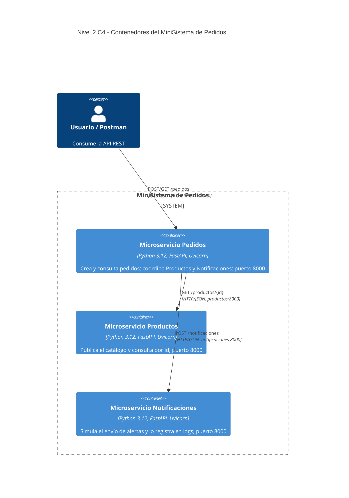
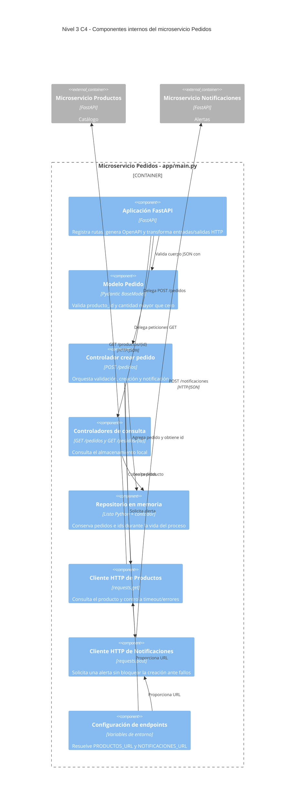
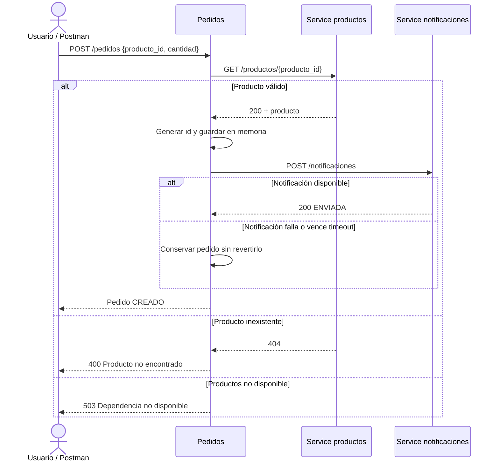
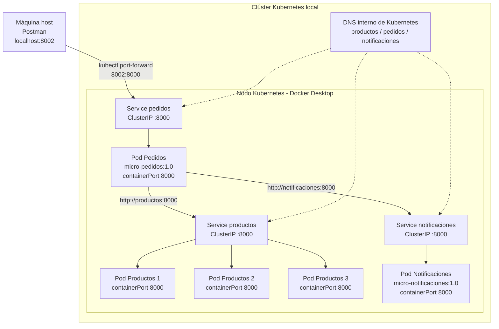

# Taller de Microservicios con Docker y Kubernetes

Este documento consolida, paso a paso, la implementación, el despliegue, las
pruebas y el análisis arquitectónico del MiniSistema de Pedidos. Cada sección
debe completarse con información verificable del repositorio y con las evidencias
obtenidas durante la ejecución del taller.

> Estado del documento: versión de trabajo. Los textos marcados como
> **pendiente de integración** deben ser completados por el equipo. Los elementos
> marcados como **pendientes de validación** ya tienen una descripción preliminar,
> pero requieren contrastarse con el despliegue final.

## Contenido

1. Introducción y descripción del problema
2. Vistas y diagramas de arquitectura
3. Implementación de los microservicios e integración
4. Contenerización con Docker
5. Despliegue, Service Discovery y escalabilidad en Kubernetes
6. Estrategia y resultados de pruebas
7. Análisis arquitectónico comparativo
8. Repositorio Git, ejecución y anexos

## 1. Introducción y descripción del problema

**Pendiente de integración:** presentar el contexto del MiniSistema de Pedidos,
el problema abordado, los objetivos del taller y el alcance de la solución. La
introducción debe explicar brevemente la transición desde una aplicación
monolítica conceptual hacia tres microservicios independientes: Productos,
Pedidos y Notificaciones.

### 1.1 Objetivo general

**Pendiente de integración:** indicar el propósito general del taller.

### 1.2 Objetivos específicos

**Pendiente de integración:** enumerar los resultados esperados relacionados con
FastAPI, Docker, Kubernetes, comunicación entre servicios, escalabilidad y
recuperación ante fallos.

### 1.3 Alcance

La solución cubre la consulta de productos, la creación y consulta de pedidos y
la simulación del envío de notificaciones. El ejercicio utiliza almacenamiento
en memoria y comunicación HTTP/REST; no incluye base de datos, autenticación,
API Gateway, mensajería asíncrona ni proveedores reales de correo.

## 2. Vistas y diagramas de arquitectura

### 2.1 Diagrama de contexto de alto nivel - C4 Nivel 1

El MiniSistema de Pedidos permite que un usuario, utilizando Postman u otro
cliente HTTP, consulte y cree pedidos. El límite del sistema comprende los tres
microservicios y su infraestructura de ejecución. No existen, en la versión del
taller, pasarelas de pago, bases de datos ni proveedores externos de correo: la
notificación se simula mediante un registro en la salida del contenedor.


Kubernetes aparece como sistema fronterizo de soporte y no como parte de la
lógica de negocio. El usuario accede temporalmente a Pedidos mediante
`kubectl port-forward`, por lo que no se expone directamente ninguno de los
otros dos microservicios.

### 2.2 Diagrama de contenedores / arquitectura lógica - C4 Nivel 2

La solución separa tres capacidades. Cada microservicio es una aplicación
FastAPI independiente, empaquetada en su propia imagen Docker y atendida por
Uvicorn en el puerto interno `8000`.



#### Responsabilidades e interfaces

| Contenedor | Responsabilidad | Endpoints | Dependencias salientes |
|---|---|---|---|
| Productos | Mantener y consultar el catálogo en memoria | `GET /productos`, `GET /productos/{producto_id}` | Ninguna |
| Pedidos | Validar el producto, crear y consultar pedidos y coordinar la alerta | `POST /pedidos`, `GET /pedidos`, `GET /pedidos/{pedido_id}` | Productos y Notificaciones |
| Notificaciones | Recibir y simular el envío de una notificación | `POST /notificaciones` | Ninguna |

El acoplamiento entre servicios se limita a contratos HTTP/JSON y nombres DNS.
No se comparten memoria, código de ejecución ni almacenamiento. Sin embargo,
Pedidos conoce la estructura de la respuesta de Productos y realiza llamadas
síncronas, por lo que todavía existe acoplamiento de contrato y temporal.

### 2.3 Diagrama de componentes de Pedidos - C4 Nivel 3

Los siguientes son componentes **lógicos** identificados dentro de
`pedidos/app/main.py`. En la implementación actual todos residen en el mismo
módulo; el diagrama no pretende afirmar que existan archivos separados.



La ruta `POST /pedidos` implementa esta secuencia:



### 2.4 Diagrama físico y de despliegue

El diagrama representa la arquitectura objetivo requerida por el taller. El
Service `productos` balancea las solicitudes entre tres réplicas equivalentes.
Los Services son de tipo `ClusterIP`, proporcionan una dirección estable y se
descubren por DNS interno. El acceso desde el host solo se habilita hacia
Pedidos mediante port-forwarding.



#### Mapeo físico

| Elemento | Cantidad objetivo | Puerto | Función |
|---|---:|---:|---|
| Deployment Productos | 1 | No aplica | Mantiene el estado deseado de tres Pods |
| Pods Productos | 3 | 8000 | Atienden consultas de catálogo |
| Service Productos | 1 | 8000 → 8000 | DNS estable y balanceo entre réplicas |
| Deployment Pedidos | 1 | No aplica | Mantiene un Pod de coordinación |
| Pod Pedidos | 1 | 8000 | Atiende la API principal |
| Service Pedidos | 1 | 8000 → 8000 | Punto estable para acceso al Pod |
| Deployment Notificaciones | 1 | No aplica | Mantiene un Pod de notificación |
| Pod Notificaciones | 1 | 8000 | Recibe y registra alertas |
| Service Notificaciones | 1 | 8000 → 8000 | Nombre DNS estable para Pedidos |
| Port-forward | Temporal | 8002 → 8000 | Conecta el host con Service Pedidos |

**Pendientes de validación con el equipo:** confirmar que Productos se ejecutó
realmente con tres réplicas; registrar el nombre y número real de nodos; comprobar
el comando de port-forward; y sustituir la arquitectura objetivo por capturas del
estado observado cuando estén disponibles.

## 3. Implementación de los microservicios e integración

Esta sección debe documentar el código fuente y demostrar cómo se completa el
flujo funcional entre las tres APIs.

### 3.1 Microservicio Productos

**Pendiente de integración:** explicar la implementación de los endpoints
`GET /productos` y `GET /productos/{producto_id}`, las respuestas exitosas y el
manejo del producto inexistente mediante HTTP 404. Añadir capturas de Swagger o
ejemplos reales de petición y respuesta.

### 3.2 Microservicio Pedidos

Pedidos actúa como coordinador del caso de uso. Recibe una solicitud, valida el
cuerpo con Pydantic, consulta Productos, registra temporalmente el pedido y
solicita una notificación. También ofrece endpoints para consultar todos los
pedidos o buscar uno por identificador.

**Pendiente de integración:** añadir ejemplos reales de `POST /pedidos`,
`GET /pedidos` y `GET /pedidos/{pedido_id}`, junto con las evidencias de Swagger.

### 3.3 Microservicio Notificaciones

**Pendiente de integración:** explicar la recepción de `POST /notificaciones` y
anexar los logs que evidencien la simulación exitosa del envío de la alerta.

### 3.4 Flujo de integración entre servicios

**Pendiente de integración:** documentar el resultado real del recorrido
Usuario → Pedidos → Productos → Pedidos → Notificaciones y agregar las evidencias
de la prueba de extremo a extremo.

## 4. Contenerización con Docker

Cada microservicio dispone de un Dockerfile basado en `python:3.12-slim`. Las
imágenes copian su archivo de dependencias, instalan los paquetes, incorporan el
código y ejecutan Uvicorn en `0.0.0.0:8000`.

### 4.1 Construcción de imágenes

**Pendiente de integración:** incorporar y verificar la secuencia exacta de
comandos utilizada por el equipo para construir las imágenes:

```powershell
docker build -t micro-productos:1.0 ./productos
docker build -t micro-pedidos:1.0 ./pedidos
docker build -t micro-notificaciones:1.0 ./notificaciones
```

### 4.2 Ejecución y comprobación local

**Pendiente de integración:** documentar los comandos finales para ejecutar los
contenedores, las variables de entorno empleadas y las capturas que demuestren
el acceso local a las tres APIs.

## 5. Despliegue, Service Discovery y escalabilidad en Kubernetes

### 5.1 Aplicación de los manifiestos

**Pendiente de integración:** verificar los comandos definitivos y añadir la
evidencia de Deployments, ReplicaSets, Pods y Services en ejecución.

```powershell
kubectl apply -f k8s/productos.yaml
kubectl apply -f k8s/pedidos.yaml
kubectl apply -f k8s/notificaciones.yaml
kubectl get pods
kubectl get services
```

### 5.2 Service Discovery mediante DNS interno

Pedidos no almacena las direcciones IP variables de los Pods. Las variables de
entorno `PRODUCTOS_URL=http://productos:8000` y
`NOTIFICACIONES_URL=http://notificaciones:8000` apuntan a nombres estables de
Services. El DNS interno de Kubernetes resuelve esos nombres y cada Service
dirige el tráfico hacia un Pod seleccionado por sus etiquetas.

**Pendiente de integración:** añadir la evidencia real de que Pedidos se comunicó
con ambos Services utilizando sus nombres DNS.

### 5.3 Acceso desde la máquina host

El Service de Pedidos es interno. Para las pruebas se crea un túnel temporal
desde el puerto `8002` del host hacia el puerto `8000` del Service:

```powershell
kubectl port-forward service/pedidos 8002:8000
```

**Pendiente de validación:** confirmar que este fue el mapeo utilizado en la
ejecución final y añadir su captura.

### 5.4 Escalabilidad horizontal de Productos

**Pendiente de integración:** documentar la configuración o el comando empleado
para mantener tres réplicas, junto con la salida de
`kubectl get pods -l app=productos`.

```powershell
kubectl scale deployment productos --replicas=3
```

### 5.5 Recuperación ante la eliminación de un Pod

**Pendiente de integración:** incorporar las capturas anteriores y posteriores a
la eliminación deliberada de un Pod de Productos. Explicar la relación
Deployment → ReplicaSet → Pods y cómo Kubernetes crea el reemplazo para recuperar
el estado deseado.

## 6. Estrategia y resultados de pruebas

### 6.1 Matriz de pruebas

**Pendiente de integración:** añadir la matriz definitiva con identificador,
objetivo, precondiciones, entrada, procedimiento, resultado esperado, resultado
obtenido, estado y evidencia. Como mínimo debe cubrir:

- Consulta del catálogo de productos.
- Consulta de un producto inexistente.
- Creación válida de un pedido.
- Consulta general y consulta por id de pedidos.
- Recepción de una notificación.
- Ejecución con tres réplicas de Productos.
- Eliminación y recuperación de un Pod.
- Creación de un pedido cuando Productos no está disponible.

### 6.2 Evidencias de APIs y flujo completo

**Pendiente de integración:** insertar capturas legibles de Swagger, Postman y
logs. Cada evidencia debe tener título, comando o petición ejecutada y una breve
interpretación del resultado.

### 6.3 Prueba de falla de Productos

**Pendiente de integración:** registrar el procedimiento, la respuesta HTTP real
de Pedidos, el tiempo observado y los logs relevantes. Comparar el resultado con
el comportamiento esperado de error controlado.

## 7. Análisis arquitectónico comparativo

### 7.1 Del monolito a los microservicios

La versión monolítica hipotética del MiniSistema de Pedidos agruparía el catálogo,
la creación de pedidos y las notificaciones en un solo proceso y una sola unidad
de despliegue. Esta opción sería razonable para un sistema pequeño: necesita menos
infraestructura, simplifica las pruebas locales y permite invocar funciones en
memoria sin red. El cambio realizado en el taller no consiste únicamente en
ejecutar el mismo programa dentro de varios contenedores. La aplicación se
descompone alrededor de tres capacidades de negocio, cada una con API, imagen,
proceso y ciclo de despliegue propios.

Productos se ocupa exclusivamente del catálogo; Pedidos conserva la coordinación
del caso de uso; y Notificaciones encapsula la simulación de alertas. Esta división
reduce el acoplamiento del código y permite modificar o desplegar una capacidad sin
reconstruir las demás. La separación, no obstante, traslada complejidad desde el
código interno hacia la comunicación, el despliegue y la observabilidad.

### 7.2 Consumo de memoria

Un monolito ejecutaría normalmente un solo intérprete de Python, una instancia de
Uvicorn y una copia cargada de las bibliotecas comunes. La solución distribuida
ejecuta al menos un proceso por Pod. Con la arquitectura objetivo existen cinco
Pods de aplicación: tres de Productos, uno de Pedidos y uno de Notificaciones.
Cada proceso mantiene su propio intérprete, dependencias y memoria de trabajo.
Además, Docker Desktop y Kubernetes requieren componentes de red, DNS, control y
supervisión. Por ello, para este caso pequeño, es razonable esperar un consumo de
memoria total superior al de un monolito equivalente.

Ese incremento puede justificarse cuando la carga es desigual. Si las consultas
de productos crecen más que la creación de pedidos, Kubernetes permite ampliar
solo Productos. En un monolito habría que replicar toda la aplicación, incluso
las capacidades que no requieren recursos adicionales. La arquitectura de
microservicios sacrifica eficiencia mínima a cambio de una asignación más granular
de recursos cuando el sistema crece.

No se presentan cifras inventadas. Para convertir esta comparación cualitativa
en una medición empírica, el equipo debe registrar `kubectl top pods` o una fuente
equivalente y documentar las condiciones de la prueba. Si Metrics Server no está
disponible, el informe debe reconocer expresamente esa limitación.

### 7.3 Aislamiento y propagación de fallos

En el monolito, un error no controlado o una presión extrema de memoria puede
afectar simultáneamente productos, pedidos y notificaciones, porque comparten el
mismo proceso. Los microservicios proporcionan aislamiento de proceso y de
despliegue: la caída de un Pod de Productos no finaliza los Pods de Pedidos o
Notificaciones. Asimismo, un Deployment solicita a Kubernetes reemplazar el Pod
perdido y mantener el número deseado de réplicas.

El aislamiento no elimina la propagación funcional. Pedidos necesita una respuesta
válida de Productos antes de crear el pedido. Si Productos está indisponible, el
código captura el error de red y responde HTTP 503 de manera controlada. En cambio,
una falla de Notificaciones se tolera: el pedido permanece creado porque la
excepción se captura y no se propaga al usuario. Esto demuestra dos políticas de
fallo diferentes según la importancia de cada dependencia.

La implementación todavía tiene límites de resiliencia. Las llamadas son
síncronas, no existen reintentos, circuit breaker ni cola duradera. Además, los
pedidos se guardan en una lista local; si el Pod se reinicia, se pierden, y si se
replicara Pedidos, cada réplica tendría un estado distinto. Por consiguiente, el
aislamiento de infraestructura mejora, pero la persistencia y la entrega confiable
de notificaciones siguen siendo temas abiertos para una solución productiva.

### 7.4 Costos operativos de infraestructura

El monolito ofrece una operación sencilla: una construcción, un despliegue, un
conjunto de logs y menos puntos de falla. Para un equipo pequeño y una carga baja,
esta simplicidad puede superar los beneficios de dividir el sistema.

Los microservicios requieren tres Dockerfiles e imágenes, manifiestos separados,
configuración de red, DNS interno, administración de réplicas, pruebas de contratos
y correlación de logs entre procesos. Kubernetes añade Deployments, ReplicaSets,
Pods, Services, port-forwarding y procedimientos de diagnóstico. También crece el
costo humano: el equipo debe dominar contenerización, orquestación, observabilidad
y tratamiento de fallos distribuidos.

A cambio, la plataforma automatiza recuperación, balanceo y escalamiento. También
permite despliegues independientes y reduce el alcance técnico de ciertos cambios.
El costo operativo solo se justifica si estas propiedades responden a necesidades
reales como cargas distintas por capacidad, equipos autónomos, disponibilidad o
frecuencias de despliegue diferentes.

### 7.5 Comparación resumida

| Atributo | Monolito | Microservicios del taller |
|---|---|---|
| Unidad de despliegue | Una aplicación | Tres imágenes y Deployments |
| Comunicación interna | Llamadas en proceso | HTTP/JSON y DNS de Services |
| Memoria base | Menor, con dependencias compartidas | Mayor, por procesos, réplicas y Kubernetes |
| Escalamiento | Replica toda la aplicación | Puede escalar solo Productos |
| Aislamiento técnico | Un fallo de proceso afecta todo | Fallos separados por Pod y servicio |
| Propagación funcional | Directa dentro del proceso | Depende de timeouts y políticas por dependencia |
| Recuperación | Requiere reiniciar la aplicación | Deployment recrea Pods automáticamente |
| Persistencia actual | Podría centralizarse fácilmente | El estado en memoria se pierde y no se comparte |
| Operación | Más simple | Más imágenes, red, configuración y observabilidad |
| Conveniencia para este caso | Adecuado si el sistema permanece pequeño | Educativo y justificable si se requieren autonomía y escalamiento selectivo |

### 7.6 Conclusión

La arquitectura de microservicios no es automáticamente superior al monolito.
Para el tamaño actual del MiniSistema de Pedidos, el monolito probablemente sería
más económico en memoria y operación. La solución distribuida se vuelve valiosa
si Productos necesita escalar independientemente, si las capacidades evolucionan
a ritmos distintos o si el aislamiento y la recuperación justifican el costo de
Kubernetes. La decisión debe basarse en requisitos de calidad y capacidad
operativa, no solamente en la disponibilidad de Docker o Kubernetes.

### 7.7 Supuestos y validaciones pendientes

Antes de consolidar el informe final se debe completar esta lista:

- [ ] Confirmar `replicas: 3` para Productos en el manifiesto final o documentar
      el uso de `kubectl scale deployment productos --replicas=3`.
- [ ] Reemplazar “Nodo Kubernetes - Docker Desktop” si el equipo utiliza otro
      clúster o más de un nodo.
- [ ] Confirmar el mapeo real `localhost:8002` hacia `service/pedidos:8000`.
- [ ] Incorporar evidencia de resolución DNS mediante los nombres de Service.
- [ ] Incorporar el resultado real de eliminar un Pod de Productos.
- [ ] Incorporar la respuesta observada cuando Productos queda indisponible.
- [ ] Añadir cifras de memoria solo si fueron medidas bajo condiciones registradas.
- [ ] Revisar los diagramas si se reorganizan módulos, endpoints o nombres YAML.

## 8. Repositorio Git, ejecución y anexos

### 8.1 Repositorio y colaboración

**Pendiente de integración:** añadir el enlace oficial del repositorio y el
gráfico del árbol de commits que evidencie la colaboración del equipo. Incluir
una explicación breve de la estrategia de ramas e integración utilizada.

### 8.2 Secuencia completa de reproducción

**Pendiente de integración:** consolidar en este apartado los prerrequisitos y la
secuencia final, comprobada desde un entorno limpio, para construir las imágenes,
aplicar los manifiestos, verificar los Pods y Services, ejecutar el port-forward
y probar el flujo desde Postman. Los comandos preliminares de las secciones 4 y 5
deben corregirse aquí si la ejecución real utilizó rutas o parámetros diferentes.

### 8.3 Anexos y evidencias

**Pendiente de integración:** organizar las capturas, la colección exportada de
Postman, las mediciones disponibles, los errores encontrados y sus soluciones.
Evitar imágenes sin título o sin explicación técnica.
