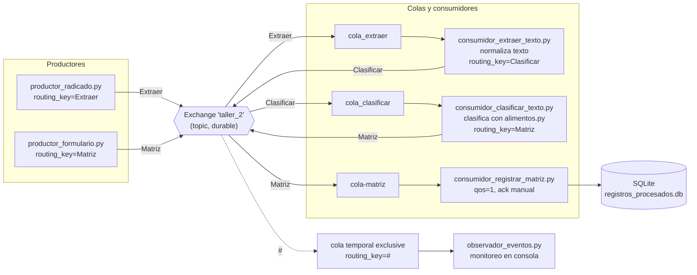

# Informe técnico — Flujo de mensajería con broker RabbitMQ

## Tabla de contenidos

1. [Análisis del problema](#1-análisis-del-problema)
2. [Arquitectura de la solución](#2-arquitectura-de-la-solución)
3. [Decisiones arquitectónicas](#3-decisiones-arquitectónicas)
4. [Implementación de los productores](#4-implementación-de-los-productores)
5. [Implementación de los consumidores](#5-implementación-de-los-consumidores)
6. [El observador de eventos](#6-el-observador-de-eventos)
7. [Manejo de errores y confiabilidad](#7-manejo-de-errores-y-confiabilidad)
8. [Evidencias de funcionamiento](#8-evidencias-de-funcionamiento)
9. [Dificultades y soluciones](#9-dificultades-y-soluciones)
10. [Conclusiones](#10-conclusiones)

LINK DE REPOSITORIO: https://github.com/GabrielJaramilloCuberos/Arquitectura-de-Software.git
---

## 1. Análisis del problema

El ejercicio plantea un escenario de **integración de sistemas basada en mensajería asíncrona**: un ciudadano radica alimentos (por ejemplo, a través de un formulario o de un registro manual), y esa información debe atravesar varias etapas de procesamiento —extracción/normalización de texto, clasificación y registro final— sin que los componentes que la producen y la consumen se conozcan entre sí ni dependan de estar disponibles al mismo tiempo.

A partir de este enunciado se identificaron los siguientes requisitos:

- **Desacoplamiento productor/consumidor:** quien publica un alimento (`productor_radicado.py`, `productor_formulario.py`) no debe conocer ni depender directamente de los procesos que lo van a normalizar, clasificar o persistir.
- **Enrutamiento por tipo de evento:** cada mensaje debe llegar únicamente a la cola correspondiente a su etapa de procesamiento (extracción, clasificación o registro), sin que un componente reciba mensajes que no le corresponden.
- **Trazabilidad del flujo:** cada mensaje debe conservar evidencia de por qué componentes ha pasado (campo `origen`) y cuántas etapas ha recorrido (campo `contador`).
- **Persistencia del resultado final:** el resultado clasificado de cada alimento debe quedar almacenado de forma durable, incluso si el proceso que lo generó ya terminó.
- **Observabilidad del sistema:** debe existir un mecanismo que permita ver, en tiempo real, todos los eventos que circulan por el sistema sin interferir con el procesamiento normal.
- **Infraestructura de mensajería sin dependencias locales:** el broker debe estar disponible para todo el equipo sin que cada integrante deba instalar y configurar su propio servidor RabbitMQ.

Estas necesidades se resolvieron con un **exchange de tipo topic** (`taller_2`) que enruta mensajes mediante *routing keys* (`Extraer`, `Clasificar`, `Matriz`) hacia colas especializadas, más una cola adicional suscrita a `#` para observar todo el tráfico sin intervenir en él.

## 2. Arquitectura de la solución

Todos los componentes comparten:

- El **mismo exchange** `taller_2`, declarado de forma idéntica (`topic`, `durable=True`) en cada script, para que cualquier productor o consumidor que se inicie pueda operar contra la misma topología aunque los demás procesos aún no existan.
- La **misma configuración de conexión** centralizada en [`config.py`](config.py), apuntando a una instancia de RabbitMQ alojada en CloudAMQP.
- Un **formato de mensaje común en JSON**, con los campos `origen`, `alimento`/`elemento` y `contador`, que cada etapa enriquece antes de reenviarlo.

## 3. Decisiones arquitectónicas

| Decisión | Justificación |
|---|---|
| Broker RabbitMQ alojado en CloudAMQP en vez de un contenedor local | Entorno de mensajería compartido, accesible para todos los integrantes del equipo sin instalar ni administrar RabbitMQ localmente, a costa de depender de conectividad a internet. |
| Exchange único de tipo `topic` (`taller_2`) en lugar de un exchange por etapa | Permite enrutar todos los eventos del flujo con un solo punto de publicación, usando *routing keys* (`Extraer`, `Clasificar`, `Matriz`) para decidir el destino, y habilita que el observador se suscriba a `#` para ver todo el tráfico sin duplicar exchanges. |
| Configuración centralizada en `config.py` (`get_connection()`, `EXCHANGE`) | Evita repetir host, credenciales y nombre del exchange en cada script; un cambio de broker solo requiere editar un archivo. |
| Mensajes en JSON con campos `origen` y `contador` | Da trazabilidad mínima al flujo: cualquier consumidor u observador puede saber qué componente generó o modificó el mensaje por última vez y cuántas etapas ha recorrido, sin necesidad de correlación externa. |
| Cada etapa del flujo en un proceso independiente (`consumidor_extraer_texto.py`, `consumidor_clasificar_texto.py`, `consumidor_registrar_matriz.py`) | Sigue el principio de **responsabilidad única** por componente y permite escalar, reiniciar o reemplazar cada etapa sin afectar a las demás. |
| `auto_ack=True` en los consumidores intermedios (Extraer, Clasificar) vs. `auto_ack=False` + `basic_qos(prefetch_count=1)` en el consumidor final (Registrar Matriz) | Las etapas intermedias solo transforman y reenvían el mensaje (bajo riesgo si se pierde uno en caso de caída), mientras que el consumidor final persiste en SQLite; se prioriza no perder datos en el último eslabón del flujo, aceptando procesar un mensaje a la vez. |
| Persistencia en SQLite embebido en vez de una base de datos externa | Suficiente para el alcance del taller: no requiere levantar infraestructura adicional y el archivo `registros_procesados.db` se crea automáticamente en la primera ejecución. |
| Cola exclusiva y autogenerada (`queue_declare(queue="", exclusive=True)`) para el observador | Evita que el observador compita por mensajes con los consumidores reales del flujo; al suscribirse con `routing_key="#"` recibe una copia de cada evento sin retirarlo de las colas de procesamiento, y la cola se destruye automáticamente al cerrar la conexión. |

## 4. Implementación de los productores

**Archivos:** [`productor_radicado.py`](productor_radicado.py), [`productor_formulario.py`](productor_formulario.py)

`productor_radicado.py` simula el punto de entrada principal del flujo:

1. Abre una conexión y un canal contra RabbitMQ mediante `get_connection()` y declara el exchange `taller_2`.
2. Mantiene un ciclo `while True` que pide por consola el nombre de un alimento, valida que no esté vacío y permite terminar escribiendo `salir` (traducido internamente a un `KeyboardInterrupt` para reutilizar el mismo bloque de cierre que `Ctrl+C`).
3. Construye un mensaje `{"origen": "Notificacion_Radicado", "alimento": ..., "contador": 0}` y lo publica con `routing_key="Extraer"`, iniciando el recorrido del mensaje por el resto del flujo.

`productor_formulario.py` simula un segundo punto de entrada, independiente del anterior:

1. Publica un único mensaje de ejemplo `{"origen": "Notificacion_Formulario", "mensaje": "Formulario ciudadano recibido", "contador": 0}` directamente con `routing_key="Matriz"`, saltándose las etapas de extracción y clasificación.
2. Esto demuestra que el exchange `topic` permite que **distintos orígenes entren al flujo en distintos puntos**, según la routing key que utilicen, sin que el resto de la arquitectura deba cambiar.

## 5. Implementación de los consumidores

**Archivos:** [`consumidor_extraer_texto.py`](consumidor_extraer_texto.py), [`consumidor_clasificar_texto.py`](consumidor_clasificar_texto.py), [`consumidor_registrar_matriz.py`](consumidor_registrar_matriz.py)

Los tres consumidores comparten el mismo patrón de arranque: declarar el exchange, declarar su cola (`durable=True`), enlazarla al exchange con su *routing key* específica y registrar un `callback` con `basic_consume`.

**`consumidor_extraer_texto.py`** escucha `cola_extraer` (routing key `Extraer`) y normaliza el nombre del alimento con `normalizar_alimento()`: recorta espacios, convierte a minúsculas y elimina tildes/diacríticos usando la descomposición Unicode `NFD` y filtrando los caracteres de categoría `Mn`. Incrementa `contador`, actualiza `origen` a `"Extraer_Texto"` y republica el mensaje con `routing_key="Clasificar"`.

**`consumidor_clasificar_texto.py`** escucha `cola_clasificar` (routing key `Clasificar`) y busca el alimento normalizado en el diccionario [`alimentos.py`](alimentos.py) (Proteína, Fruta o Verdura), asignando `"Desconocido"` si no existe con `dict.get(...)`. Agrega el campo `tipo`, incrementa `contador`, actualiza `origen` a `"Clasificar_Texto"` y republica el mensaje con `routing_key="Matriz"`.

**`consumidor_registrar_matriz.py`** escucha `cola-matriz` (routing key `Matriz`), la cual recibe tanto los mensajes que vienen del clasificador como los que publica `productor_formulario.py` directamente. Es el único consumidor que:

- Inicializa la base de datos SQLite (`inicializar_base_datos()`), creando la tabla `registros_procesados` si no existe y migrando en caliente la columna `contador_final` si la base ya existía sin ella.
- Acepta mensajes con claves alternativas (`elemento`/`alimento`, `tipo_elemento`/`tipo`) mediante `obtener_datos_mensaje()`, validando que ambos campos existan y que `contador` sea un entero antes de continuar.
- Usa `basic_qos(prefetch_count=1)` y `auto_ack=False`: el mensaje solo se confirma (`basic_ack`) **después** de que `guardar_registro()` inserta la fila en SQLite, garantizando que un mensaje no se pierda si el proceso falla justo antes de persistirlo.

## 6. El observador de eventos

**Archivo:** [`observador_eventos.py`](observador_eventos.py)

En lugar de suscribirse a una cola de procesamiento, este componente declara una **cola temporal y exclusiva** (`queue_declare(queue="", exclusive=True)`) y la enlaza al exchange con `routing_key="#"`, el comodín de los exchanges `topic` que representa "cero o más palabras". Esto hace que reciba una copia de **todos** los mensajes publicados en `taller_2`, sin importar su routing key, sin retirarlos de las colas reales y sin necesidad de declarar esa cola de antemano en ningún otro script. Por cada evento imprime la hora de recepción, la routing key (`method.routing_key`), el `origen` y el `contador` del mensaje, ofreciendo una vista de monitoreo en tiempo real de todo el flujo.

## 7. Manejo de errores y confiabilidad

| Aspecto | Productores y consumidores intermedios (Radicado, Formulario, Extraer, Clasificar, Observador) | Consumidor final (Registrar Matriz) |
|---|---|---|
| Confirmación de mensajes | `auto_ack=True`: RabbitMQ da el mensaje por entregado tan pronto lo envía, sin esperar a que el callback termine con éxito. | `auto_ack=False` + `basic_qos(prefetch_count=1)`: el `ack` se envía manualmente solo después de insertar el registro en SQLite. |
| Mensaje mal formado o con campos inválidos | No se valida explícitamente; un `KeyError` o `json.JSONDecodeError` propagaría la excepción y detendría el proceso. | Capturado explícitamente (`json.JSONDecodeError`, `ValueError` en `obtener_datos_mensaje`); el mensaje se descarta con `basic_nack(requeue=False)` para no reintentarlo indefinidamente. |
| Error de base de datos | No aplica. | Capturado (`sqlite3.Error`); se hace `basic_nack(requeue=True)` para que RabbitMQ reintente la entrega, asumiendo que el fallo puede ser transitorio. |
| Error inesperado en el callback | No se captura; detendría el `start_consuming()` del proceso. | Capturado con un `except Exception` genérico y `basic_nack(requeue=True)`, para no perder el mensaje ante un fallo no anticipado. |
| Cierre del proceso (`Ctrl+C`) | Capturado con `except KeyboardInterrupt`, imprime mensaje de cierre y libera la conexión en `finally`. | Igual mecanismo, además de verificar `connection.is_open` antes de cerrar para evitar excepciones si la conexión nunca llegó a abrirse. |
| Fallo al establecer la conexión inicial | Se propaga como excepción no capturada (falla rápido, `fail-fast`). | Capturado con un `except Exception` alrededor de todo `main()`, que informa el error sin dejar un traceback crudo. |

**Conclusión de esta sección:** el flujo aplica un manejo de errores **asimétrico y deliberado**: las etapas intermedias priorizan simplicidad y throughput (`auto_ack=True`, sin captura de errores de negocio), porque perder o duplicar un mensaje en tránsito tiene bajo costo al ser fácilmente reproducible por el usuario. El consumidor final, en cambio, es el punto donde el dato se vuelve durable, por lo que concentra el manejo de errores explícito (mensajes inválidos descartados, errores de base de datos reintentados, `ack` solo tras persistir), siguiendo el principio de que la confiabilidad debe reforzarse en el punto donde el efecto es irreversible.

## 8. Evidencias de funcionamiento

> Esta sección debe completarse con capturas reales de la ejecución. A continuación se listan los puntos donde deben insertarse, siguiendo el flujo descrito en el [README](README.md).

1. `[Captura 1: instalación de dependencias con pip install -r requirements.txt]`

2. `[Captura 2: consola de observador_eventos.py mostrando "👁️ Observador de eventos escuchando TODO..."]`

3. `[Captura 3: las tres terminales de consumidor_extraer_texto.py, consumidor_clasificar_texto.py y consumidor_registrar_matriz.py en estado "escuchando..."]`

4. `[Captura 4: productor_radicado.py enviando un alimento, ej. "manzana", y el mensaje "✅ Enviado a cola_extraer: manzana"]`

5. `[Captura 5: consola de consumidor_extraer_texto.py mostrando la normalización del texto y el reenvío a cola_clasificar]`

6. `[Captura 6: consola de consumidor_clasificar_texto.py mostrando el tipo detectado (ej. "🏷️ Tipo: Fruta") y el reenvío a cola-matriz]`

7. `[Captura 7: consola de consumidor_registrar_matriz.py mostrando "✅ Registro insertado en la Matriz de Participación"]`

8. `[Captura 8: consola de observador_eventos.py mostrando los mismos eventos capturados por routing_key="#" en tiempo real]`

9. `[Captura 9: contenido de registros_procesados.db (ej. con "sqlite3 registros_procesados.db 'SELECT * FROM registros_procesados;'") evidenciando el registro persistido]`

## 9. Dificultades y soluciones

| # | Dificultad encontrada | Solución aplicada |
|---|---|---|
| 1 | El mismo flujo debe aceptar alimentos escritos con mayúsculas, espacios extra o tildes (ej. "Manzána ", "MANZANA") sin que se traten como categorías distintas. | Se implementó `normalizar_alimento()` en el consumidor de extracción, combinando `strip()`, `lower()` y descomposición Unicode `NFD` para eliminar diacríticos conservando la letra base. |
| 2 | Distintos orígenes (`productor_radicado.py`, `productor_formulario.py`) necesitan entrar al flujo en puntos distintos sin duplicar la lógica de enrutamiento. | Se aprovechó el exchange `topic` con distintas *routing keys* (`Extraer` vs. `Matriz`) para que cada productor publique directamente en la etapa que le corresponde. |
| 3 | El consumidor final debía tolerar mensajes con nombres de campo distintos según su origen (`alimento`/`elemento`, `tipo`/`tipo_elemento`), sin romper el flujo. | `obtener_datos_mensaje()` normaliza ambas variantes con `dict.get(...)` antes de validar y persistir, aceptando cualquiera de los dos formatos. |
| 4 | Evitar perder un registro si el proceso de persistencia falla justo después de recibir el mensaje. | Se desactivó el `auto_ack` en el consumidor final, se limitó a un mensaje en vuelo por consumidor (`basic_qos(prefetch_count=1)`) y el `ack` solo se envía tras confirmar la escritura en SQLite. |
| 5 | Distinguir entre un mensaje irrecuperable (mal formado) y un fallo transitorio (ej. base de datos bloqueada momentáneamente), para no reintentar indefinidamente algo que nunca va a funcionar. | Se separaron los `except`: `json.JSONDecodeError`/`ValueError` hacen `basic_nack(requeue=False)` (se descarta), mientras que `sqlite3.Error` y errores inesperados hacen `basic_nack(requeue=True)` (se reintenta). |
| 6 | Observar todo el tráfico del exchange sin interferir con las colas de procesamiento reales ni dejar colas huérfanas al cerrar el observador. | Se usó una cola autogenerada y `exclusive=True` enlazada con `routing_key="#"`, que RabbitMQ elimina automáticamente al cerrarse la conexión. |
| 7 | Si la base de datos SQLite ya existía de una ejecución previa sin la columna `contador_final`, agregarla no debía borrar los registros existentes. | Se consultó `PRAGMA table_info(...)` y se ejecutó `ALTER TABLE ... ADD COLUMN` solo si la columna aún no existía, preservando los datos previos. |
| 8 | Terminar el productor interactivo (`productor_radicado.py`) de forma controlada tanto si el usuario escribe "salir" como si presiona `Ctrl+C`. | Se hizo que escribir "salir" lance manualmente un `KeyboardInterrupt`, reutilizando el mismo bloque `except`/`finally` que cierra la conexión en ambos casos. |
| 9 | Necesidad de un broker RabbitMQ accesible por todo el equipo sin que cada integrante deba instalar y mantener su propia instancia. | Se utilizó una instancia gestionada de RabbitMQ en CloudAMQP, con las credenciales centralizadas en `config.py`. |

## 10. Conclusiones

- El uso de un **exchange topic único** con *routing keys* específicas (`Extraer`, `Clasificar`, `Matriz`) permitió construir un flujo de varias etapas totalmente desacoplado: cada productor y cada consumidor solo conoce el nombre del exchange y su propia routing key, no la existencia de los demás componentes.
- El comodín `#` de los exchanges `topic` resultó clave para implementar observabilidad **sin invadir** el flujo de procesamiento: una cola exclusiva y temporal puede espiar todo el tráfico sin competir por los mensajes con los consumidores reales.
- La confiabilidad del sistema no se aplicó de forma uniforme, sino **donde el costo de perder un mensaje es mayor**: las etapas intermedias usan `auto_ack` por simplicidad, mientras que el consumidor que escribe en SQLite usa `ack` manual, `prefetch_count=1` y manejo diferenciado de errores (descartar vs. reintentar), priorizando no perder datos en el punto donde se vuelven persistentes.
- Enriquecer el mensaje en cada etapa (`contador`, `origen`) dio trazabilidad básica al flujo sin necesidad de un sistema de correlación externo, lo cual fue suficiente para el alcance del taller y para depurar el comportamiento a través del observador de eventos.
- Usar un broker administrado (CloudAMQP) y una base de datos embebida (SQLite) fueron decisiones que priorizaron la reproducibilidad y la simplicidad de infraestructura sobre el rendimiento o la escalabilidad, en línea con el propósito educativo del ejercicio.
